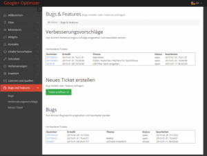
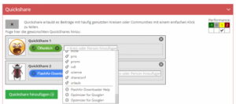

# Der Google+ - Optimizer 3.0 ist fertig!
_22.02.2015 00:00:00_
|Categories|
|-|
|[anwendungen](/dotnetwork/de/categories#anwendungen) :black_small_square: [javascript-programmierung](/dotnetwork/de/categories#javascript-programmierung) :black_small_square: [jquery-programmierung](/dotnetwork/de/categories#jquery-programmierung)|

|Tags|
|-|
|[chrome-extensions](/dotnetwork/de/tags#chrome-extensions) :black_small_square: [optimizer](/dotnetwork/de/tags#optimizer)|

Ja. Endlich ist es soweit. Version 3.0 wird auf die Menschheit (also Euch :) ) losgelassen. Die wesentlichen Änderungen zur 2er-Version im Überblick:

- Setup-Bereich hübscher :)
- ... und deutlich übersichtlicher
- Starke Performance-Verbesserungen
- Reduzierung der Größe (6 MB->880KB)
- Open Source (s.u.)
- QuickShare erlaubt Communities (s.u.)

# Anmerkungen:

Da ich "keinen Stein auf dem Anderen" gelassen habe, habe ich die neue Version zunächst als eigene Extension (Preview) im Chrome-Store angemeldet. Das heißt, die neue Version kann von Euch in Ruhe getestet werden. Bitte nutzt die Chance. **Ohne Euer Feedback habe ich keine Chance, evtl. doch noch vorhandene Bugs zu entfernen**, bevor die Version in den "offiziellen" Shop wandert. Deaktiviert einfach so lange Euren "alten" Optimizer in Chrome. Nutzt bitte zum Melden von Bugs direkt den Setup-Bereich "Bugs und Features":

Danke für Euer Feedback. Scheint doch ganz ordentlich zu laufen :)

# Limitierungen:

Diese Version kann alles, was die alte (derzeitige) Version auch kann. Mit folgenden Ausnahmen: - Der Wizard fehlt noch - Das Sport-Widget wurde entfernt - Die Quickhashtags (Liste auf linker Seite) wurden entfernt, weil (noch) zu hässlich :) - Es fehlt noch das Tutorial - Video - Die englische Übersetzung fehlt

# Reduzierung der Größe

Die wesentlichen Elemente, welche die Extension aufgebläht haben wurden entfernt. So wurden beispielsweise die Icons für den Quickshare aus der Extension entfernt und werden - nur bei Bedarf - aus dem Internet nachgeladen.

# Open Source

Der Optimizer ist jetzt Open Source (GPL). Wer will, kann sich die Sourcen direkt bei [GitHub](https://github.com/OleAlbers/GooglePlusOptimizer) herunterladen. Wer die Extension einfach nur anwenden will, bleibt natürlich beim Chrome Webstore

# Quickshare-Communities

Die Quickshare-Funktion ist jetzt insgesamt komfortabler geworden. Sie erlaubt nun auch das Verwenden von Communities. Damit die Liste der Communities korrekt eingelesen wird, muss einmalig (bzw. nach dem Hinzufügen von Communities) die [Liste der eigenen Communities](https://plus.google.com/u/0/communities) geöffnet werden. Derzeit funktioniert QuickShare nur mit Communities, die keine Kategorien besitzen.

# Download

Last but not Least: Der Link zur aktuellen Version:

[Google+ Optimizer 3.0](https://chrome.google.com/webstore/detail/google%2B-optimizer/edknapjhmlocokbpbihilmjmfmmddhop)
