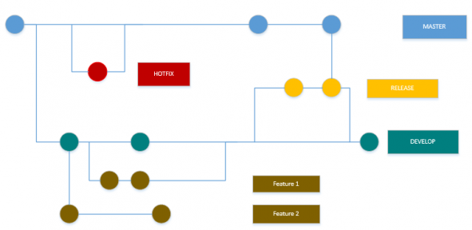
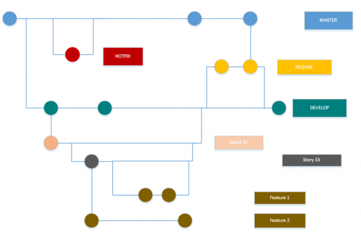

# SCRUM und Git: Optimierter Workflow // Mit vielen tollen bunten Farben :)
_Published:_ 04.03.2015 00:00:00

_Categories_:[programmierung](/dotnetwork/de/categories#programmierung)

_Tags_:[git](/dotnetwork/de/tags#git) - [scrum](/dotnetwork/de/tags#scrum)

Viele Teams entscheiden sich für GIT, um den Code zu verwalten. Meines macht hier keine Ausnahme. Dieser Post ist aber nicht auf GIT limitiert, sondern funktioniert (mit kleinen Modifikationen) auch mit TFS oder SVN.

## Warum sollte man überhaupt den Git Flow für SCRUM anpassen?

GIT und SCRUM sind doch zwei komplett unterschiedliche Welten?

Prinzipiell stimmt das. Aber während SCRUM ein sehr flexibles Arbeiten erlaubt, sind seine Paradigmen teilweise sehr strikt:

- Man arbeitet in Sprints
- In jedem Sprint werden User-stories definiert, die implementiert werden sollen

Deshalb haben wir uns entschieden, diese Vorgehensweise auch im git flow abzubilden.

## Klassischer Git Flow:

Normalerweise besitzt man folgende Struktur bei einem git flow (Eine ausführlichere Beschreibung und hübschere Bilder gibt es bei [Atlassian](https://www.atlassian.com/git/tutorials/comparing-workflows/gitflow-workflow))

Man startet immer mit dem master branch. Davon werden einzelne Branches pro Hotfix erzeugt. Neue Features werden in eigenen Branches hinterlegt, die vom development branch abgehen. Ist ein Feature abgeschlossen, so wird es zurück in den Development Branch überführt. Wird ein Release erzeugt, so wird es aus dem Development\-Branch erzeugt, welcher die einzelnen Release\-Branches enthält. Wenn das Release komplett getestet und abgeschlossen ist, geht es zurück in den Development\-Branch und ebenfalls in den master -Branch.

 

## "Scrumifizierter" Git Flow:

Um die elementare SCRUM-Logik im git flow abzubilden reicht es, **zwei zusätzliche Schichten** hinzuzufügen. Die einzelnen Features werden jetzt nicht mehr direkt aus dem Development\-Branch erzeugt. Stattdessen wird pro Sprint ein neuer Branch aus dem Development\-Branch erzeugt. Vom Sprint wiederum werden die einzelnen User Stories erzeugt. Erst in diesen Stories werden die eigentlichen Features (wie vorher als eigener Zweig) erzeugt.

Das Zusammenführen der Zweige erfolgt auf dem gleichen Wege: Die Features werden mit der User Story gemerged, die User Story mit dem Sprint, der dann wiederum in den Development\-Branch zusammengeführt wird.

Das ist ein wenig mehr Arbeit als der "klassische" Git flow (und sieht Anfangs etwas chaotisch aus), transferiert aber die Vorteile des klassischen Git Flows mit hinein in den Sprint. Wie bisher werden nur die Features ausgeliefert, die auch abgeschlossen sind, aber jetzt werden auch nur komplette User Stories ausgeliefert.

Und als kleinen Bonus bekommt man eine Historie, welche User Story zu welchem Sprint gehört. Eine Win-Win-Situation, wie die Marketing-Fuzzis sagen würden. (Nicht, dass sie auch nur einen Satz von dem hier verstehen würden :) )

Bei Fragen gerne die Kommentarfunktion verwenden.
