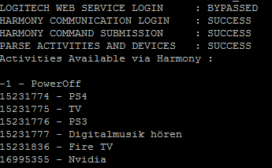
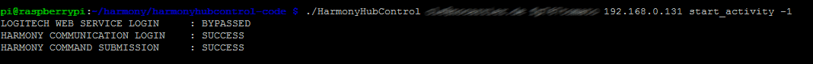

# Logitech Harmony Hub mit dem Raspberry / Linux steuern
_Published:_ 15.01.2016 00:00:00

_Categories_:[linux](/dotnetwork/de/categories#linux) - [os](/dotnetwork/de/categories#os)

_Tags_:[home-automation-de](/dotnetwork/de/tags#home-automation-de) - [logitech](/dotnetwork/de/tags#logitech) - [raspberry-pi-de](/dotnetwork/de/tags#raspberry-pi-de)


Meine Überwachungskamera [zeichnet nun also alles auf, wenn ich weg bin](http://dotnet.work/2016/01/synology-surveillance-station-mit-einem-einfachen-shell-script-automatisieren/), die LEDs [gehen korrekt an und aus](http://dotnet.work/2016/01/leds-einer-ueberwachungskamera-per-linux-ein-und-ausschalten/). Aber was ist, wenn der Fernseher läuft? Es soll ja Leute geben, die vergessen, ihn auszuschalten. Auch dafür gibt es eine Lösung, denn wenn eine Harmony Hub - Fernbedienung vorhanden ist, lässt sie sich über das kleine, aber feine Tool "HarmonyHubControl" fernsteuern.

Dazu muss zunächst einmal das Projekt auf den Raspberry kommen. Am einfachsten geht das über das meist vorinstallierte Git:
```
git clone git://git.code.sf.net/p/harmonyhubcontrol/code harmonyhubcontrol-code
```

Alternativ darf man natürlich auch gerne manuell das Projekt per ZIP herunterladen und entpacken.

Ist das geschehen, muss aus dem Quellcode noch die Binary erstellt werden. Keine Sorge. Geht hier sehr einfach und Abhängigkeiten gibt es auch nicht. Ein einfaches
```
make
```

reicht im Ordner, in dem der Quellcode liegt.

Kurze Zeit später ist dann die ausführbare Datei "HarmonyHubControl" im Verzeichnis vorhanden. Jetzt sollte man bereits auf die Hub zugreifen können. Dafür benötigt man zunächst einmal die IP-Adresse. Die sollte im Router einsehbar sein. Das Gerät taucht hier üblicherweise unter dem Namen "HarmonyHub" auf.

Nun also erst einmal ein Test, ob die Verbindung klappt.
```
./HarmonyHubControl \[Login\] \[Passwort\] \[Ip\]
```

**Wichtig!** Prüft das Passwort vorher lieber zwei mal. Ist es falsch, werden die Daten dennoch angezeigt, aber beim nächsten Login über das MyHarmony-Tool wird die Warnung angezeigt, dass es zu viele Versuche gab und man eine halbe Stunde warten muss. Keine Ahnung, was Logitech sich bei dem "Sicherheitskonzept" gedacht hat.\

Der Login ist die E-Mail-Adresse. Sofern man nicht seinen Benutzernamen und Passwort vergessen hat, sollte das Ergebnis nach Eingabe der Daten wie folgt aussehen: [](http://dotnet.work/wp-content/uploads/2016/01/hh1.png)

Dann lassen sich jetzt alle gespeicherten Aktivitäten auflisten:
```
./HarmonyHubControl \[Login\] \[Passwort\] \[Ip\] list\_activies
```

[](http://dotnet.work/wp-content/uploads/2016/01/HH2.png) Wie man sehen kann gibt es immer eine Aktivität mit der Id "-1". Diese schaltet sämtliche Geräte aus, entspricht also dem Power-Button auf der Fernbedienung. Will man stattdessen eine Aktivität aktivieren übergibt man stattdessen dessen ID:
```
./HarmonyHubControl \[Login\] \[Passwort\] \[Ip\] start\_activity 15231836
```
Aktiviert bei mir die FireTV,
```
./HarmonyHubControl \[Login\] \[Passwort\] \[Ip\] start\_activity -1
```
schaltet stattdessen alle Geräte aus. [](http://dotnet.work/wp-content/uploads/2016/01/hh3-1.png) Somit lässt sich beispielsweise beim Verlassen des Hauses sicher stellen, dass keine Hifi-Geräte o.ä. mehr angelassen wurden. Mit Funksteckdosen u.ä. lässt sich das Ganze natürlich noch weiter treiben.

Wer will kann natürlich noch andere Aktionen starten. Wie wäre es beispielsweise damit, sich morgens von der Stereoanlage wecken zu lassen? Wem das alles nicht reicht, der kann auch jedem einzelnen Gerät ein beliebiges Commando geschickt werden. "Hells Bells" automatisch als Reminder eine Stunde bevor das nächste Heimspiel des magischen FCs beginnt? Geht alles. :)
