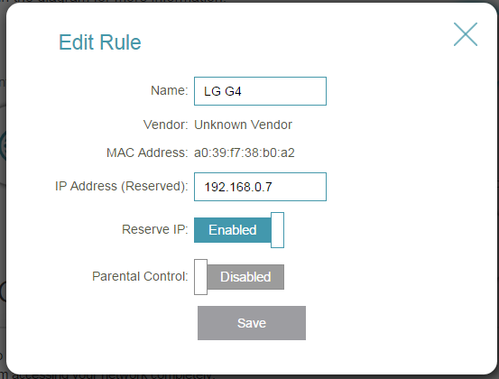

Ich besitze eine Synology Diskstation, die unter anderem eine "Surveillance Station" anbietet, mit der lokale LAN- (oder WLAN-) Kameras zur Überwachung genutzt werden. Wird eine Bewegung erkannt, so erhalte ich eine E-Mail. Man kann verschiedene Zeitpläne einstellen zu welchen Zeiten die Alarmierung erfolgen soll.

Aber so wirklich hat mich das nie zufrieden gestellt. Ich bin eben nicht immer zur gleichen Zeit zu Hause. Mal arbeite ich länger, mal kürzer, mal habe ich frei. Und wenn ich zu Hause bin, soll die Kamera deaktiviert sein. Und ich möchte das nicht manuell jedes Mal einstellen müssen.

Also habe ich mich entschieden, mein Smartphone in die Aktivierung mit einzubeziehen. Wie die meisten heutzutage, trage ich mein Smartphone eigentlich ständig bei mir. Was liegt also näher, als das Handy zu nutzen? Ist das Telefon zu Hause, bin ich es auch, und somit braucht die Kamera keine Bewegungen aufzeichnen. Umgekehrt: Ist das Handy nicht im Haus, bin ich es wohl auch nicht: Die Bewegungserkennung sollte "scharf geschaltet" werden.

Erfreulicherweise bietet die Synology eine Web-Api, mit der die Aktivierung und Deaktivierung erfolgen kann. Das Script hierzu war überraschend simpel.

Aber zunächst ein paar kleine Vorbereitungen:

Als erstes muss dafür gesorgt werden, dass das Smartphone im häuslichen WLAN immer die gleiche IP-Adresse erhält. Dies funktioniert bei jedem Router anders, bei TP-Link schimpft sich die Einstellung "Reserve IP":

 

[](http://dotnet.work/wp-content/uploads/2016/01/reserveip.png)

Zusätzlich sollte ein User auf der Synology angelegt werden. Theoretisch kann auch der vorhandene Admin-User verwendet werden, aber dessen Passwort im Klartext in ein Shell-Script zu schreiben ist eher nicht so prickelnd. Leider benötigt auch der User für das Script Adminrechte. Feinere Einstufungen zur Verwendung der Api habe ich leider noch nicht gefunden.

Auf dem Raspberry (oder jeder beliebigen anderen Linux-Kiste) sollte dann das folgende Script erzeugt werden. Es beinhaltet nur Standardfunktionialitäten, sollte also auf jeder Linux-Distribution ohne weitere Pakete laufen:
```
user='pi'
pass='circle'
server='sauger:5000'
phone='192.168.0.7'

dt=$(date '+%d/%m/%Y %H:%M:%S');
cd $(dirname $0)
touch lgstate.txt
read oldValue < lgstate.txt
if ping -c 3 ${phone} | grep 'bytes from'; then
  if \[ $oldValue != 'isda' \]; then
    echo \[${dt}\] 'Stoppe Aufzeichnung'
    echo 'isda' >lgstate.txt
    #login
    wget -q --keep-session-cookies --save-cookies cookies.txt -O- "http://${server}/webapi/auth.cgi?api=SYNO.API.Auth&method=Login&version=3&account=${user}&passwd=${pass}"
    #disable
    wget -q --load-cookies cookies.txt -O- "http://${server}/webapi/entry.cgi?api=SYNO.SurveillanceStation.Camera&method=Disable&version=3&cameraIds=1" >dev>null
    #logout
    wget -q --load-cookies cookies.txt -O- "http://${server}/webapi/auth.cgi?api=SYNO.API.Auth&method=Logout&version=3" >dev>null
  else
    echo \[${dt}\] 'Der lungert hier immer noch rum...'
  fi
else
  if \[ $oldValue != 'iswech' \]; then
    echo \[${dt}\] 'Starte Aufzeichnung'
    echo 'iswech' >lgstate.txt
    #login
    wget -q --keep-session-cookies --save-cookies cookies.txt -O- "http://${server}/webapi/auth.cgi?api=SYNO.API.Auth&method=Login&version=3&account=${user}&passwd=${pass}"
    #enable
    wget -q --load-cookies cookies.txt -O- "http://${server}/webapi/entry.cgi?api=SYNO.SurveillanceStation.Camera&method=Enable&version=3&cameraIds=1" >dev>null
    #logout
    wget -q --load-cookies cookies.txt -O- "http://${server}/webapi/auth.cgi?api=SYNO.API.Auth&method=Logout&version=3" >dev>null
  else
    echo \[${dt}\] 'Immer noch keine Sau da'
  fi
fi
```
Die Paramater "user" und "pass" bestimmen natürlich die Zugangsdaten für die Synolgy.

Unter "Server" wird die IP-Adresse oder der Hostname der Synology und die Portnummer eingetragen.

"Phone" ist die IP-Adresse des Smartphones

Was nun also macht das Script?

Zunächst versucht es, das Smartphone anzupingen. Dies versucht es mehrmals um zu verhindern, dass ein einzelner Timeout versehentlich als Abwesenheit erkannt wird. Wird das Telefon gefunden, wird zunächst geprüft, ob das Telefon bei der letzten Überprüfung schong gefunden worden ist. Ist dies der Fall, hat sich der Status nicht geändert und es passiert schlicht nichts. War das Telefon hingegen beim letzen Suchen nicht vorhanden, so ist das Telefon und damit der Besitzer wieder zu Hause und die Überwachung muss deaktiviert werden.

Nach dem gleichen Schema erfolgt die Aktivierung, wenn das Telefon nicht mehr gefunden wird.

Das Script erzeugt nur minimale Ausgaben. Sollte es zu Problemen kommen, sollten die "/dev/null" - Bereiche entfernt werden um die Ursache einzugrenzen.

Bevor das Script nun gestartet werden kann, muss einmalig eine leere Datei erzeugt werden:
```
touch lgstate.txt
```
Jetzt kann das Script manuell durch "./pingPhone.sh" gestartet werden. Die Änderungen sind sofort in der Surveillance Station sichtbar, ohne dass die Website neu geladen werden muss.

[](http://dotnet.work/wp-content/uploads/2016/01/cam1.png)

Ist mehr als eine Kamera vorhanden, muss die Id in den Scripten bei "cameraIds" angepasst werden. Es sind auch mehrere Kameras gleichzeitig möglich, indem man die IDs durch Kommas trennt:  "&cameraIds=1,4,5"

Wenn die Testläufe erfolgreich waren, kann der Cronjob dafür erstellt werden.
```
crontab -e
```
Öffnet den Editor und die folgende Zeile sorgt dafür, dass das Script automatisch alle 5 Minuten aufgerufen wird.
```
\*/15 \* \* \* \* /home/pi/pingPhone.sh >>/home/pi/pingPhone.log
```
(Der Pfad muss ggf. angepasst werden)

Als letztes muss nur noch der Zeitplan auf der Surveillance Station angepasst werden, dass die Bewegungserkennung ständig aktiviert ist.

[](http://dotnet.work/wp-content/uploads/2016/01/cam2.png)
