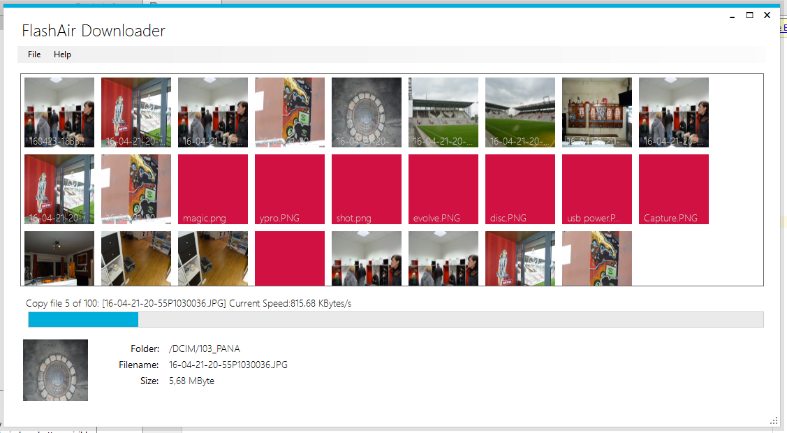

# FlashairDownloader 2
_Published:_ 01.05.2016 00:00:00

_Categories_: [anwendungen](/dotnetwork/de/categories#anwendungen) - [c](/dotnetwork/de/categories#c) - [windows](/dotnetwork/de/categories#windows)

Der FlashAirDownloader 2 ist da \\o/ (Aus reinen Faulheitsgründen werde ich ihn von nun an mit FAD abkürzen :) )

Eine Menge Nutzer haben den FlashAirDownloader (1) bereits genutzt. Dieser war ursprünglich nur als "Quick Hack" gedacht um auf meine Toshiba FlashAir - Karte zuzugreifen. Da immer mehr Nutzer nach neuen Features und Sourcecodeschnipseln gefragt haben, habe ich mich entschlossen, das Programm unter die GPL-Lizenz zu stellen und den Quellcode zu veröffentlichen.

Das Problem hierbei: Wie bereits erwähnt, war das Programm nur als Quick Hack gedacht. Lausige UI, lausiger Code, viel zu peinlich um das einsehbar zu machen. Also habe ich mich entschieden, es nochmal zu machen: Dieses Mal ordentlich; Mit halbwegs ansprechender UI (im Rahmen meiner Design-Legasthenie :)) und ordentlich kommentierten Quellcode. Dabei habe ich darauf geachtet, dass auch weiterhin alte Veteranen mit Windows XP das Programm nutzen wollen.

Aber genug gesabbelt. Da ist das Schmuckstück:

Du kannst den [Quelltext direkt von GitHub downloaden](https://github.com/OleAlbers/fad2) und dort natürlich auch das Programm verbessern. Wenn Du das Programm einfach nur nutzen willst, lade die Binaries hier herunter.:

\[wpdm\_package id='368'\]

**Du wirst eine Menge Warnmeldungen erhalten, die so wirken, als würde der Antichrist höchstpersönlich versuchen, Dir einen Virus unterzujubeln. (Hint: Dem ist nicht so) Das liegt daran, dass die Setup-Datei nicht signiert ist. Eine Signatur kostet allerdings erstens jährlich Geld und zweitens einigen Aufwand um sie einzubinden. Wenn Dir das ganze zu suspekt ist, verstehe ich das: Lade Dir stattdessen den Quellcode bei GitHub herunter und erstelle die Exe selbst durch Visual Studio.** Eine [(englische) Installationsanleitung](http://dotnet.work/2016/05/flashairdownloader-2/) findest Du hier im Blog.

Wenn es Dir gefällt, habe ich natürlich nix dagegen, wenn Du mir etwas Geld Auf meine Panama-Konten überweist schickst. Oder einfach nur Liebe. Oder noch besser: Bring Dich ein und verbessere den Code; Dann habe ich weniger zu tun - was ja der Hauptgrund für mich war, das Tool unter eine Open Source-Lizenz zu stellen. :D

        
