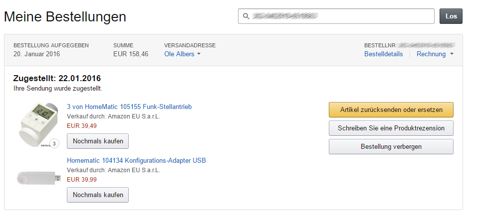
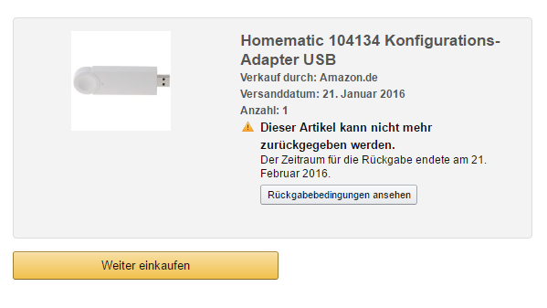
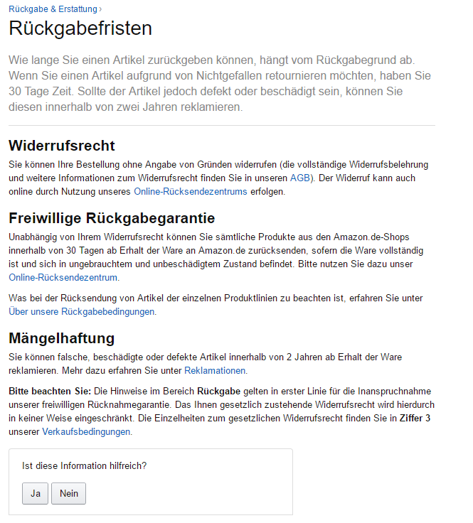
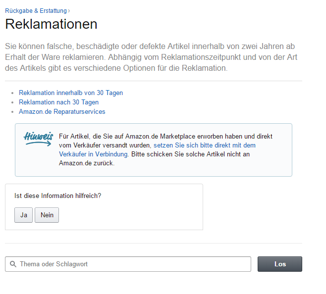
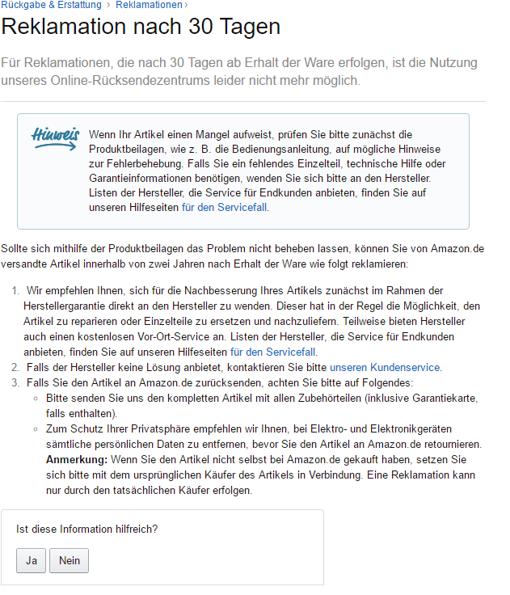
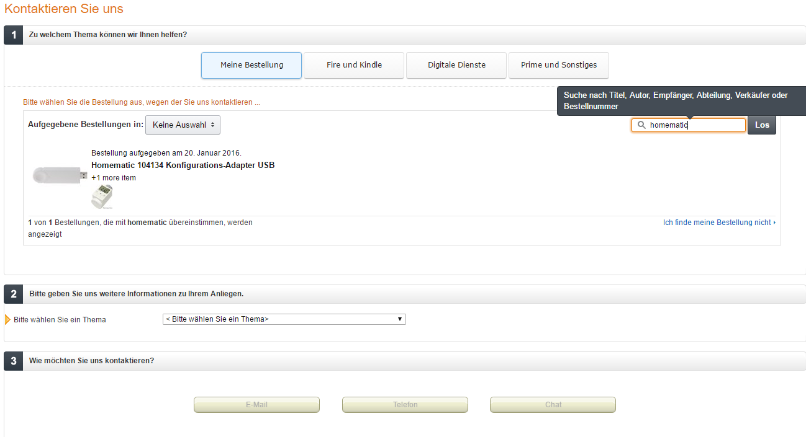
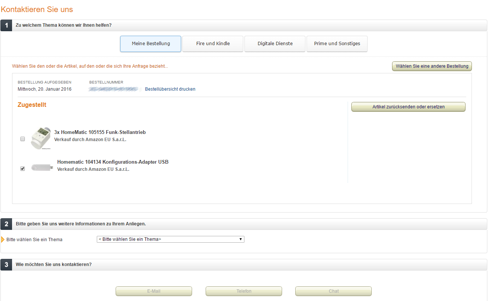
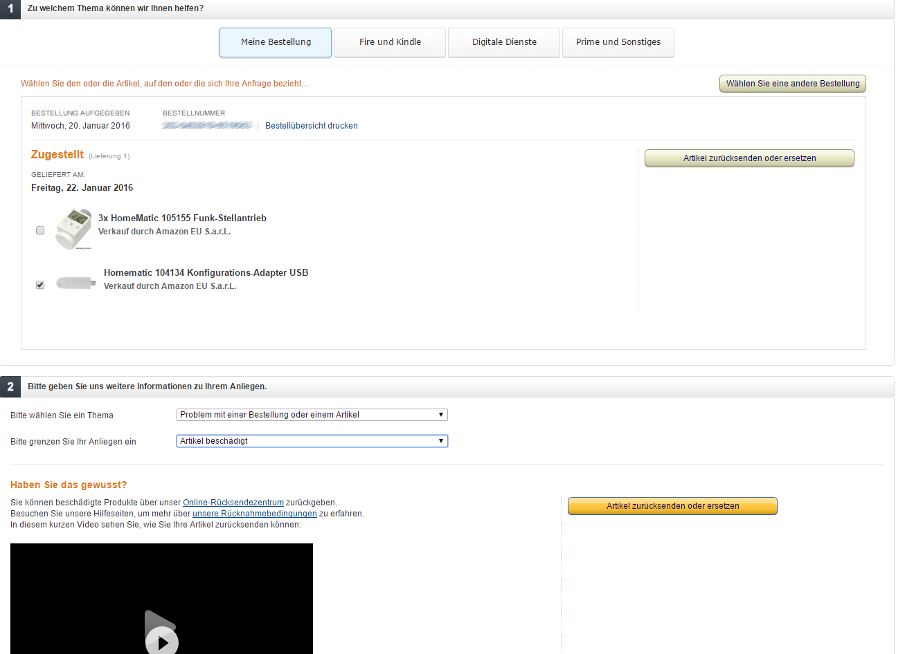
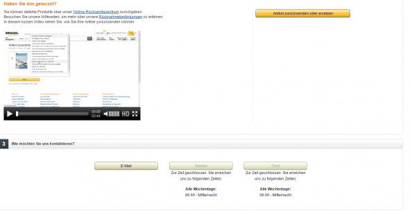

# Usability und mieses Webdesign - Wenn selbst die Großen versagen
_29.06.2016 00:00:00_
|Categories|
|-|
|[allgemein](/dotnetwork/de/categories#allgemein)|

|Tags|
|-|
|[amazon](/dotnetwork/de/tags#amazon) :black_small_square: [usability](/dotnetwork/de/tags#usability)|

Heute war es soweit: Der USB-Stick, der meinen Raspberry Pi mit der HomeMatic verbindet hat seinen Geist aufgegeben. Nach etwas Recherche kam ich zu der Erkenntnis, dass das wohl nicht so selten vorkommt. Aber kein Problem: Ist ja Amazon, da gabs eigentlich nie ein Problem mit der Garantie.

### Schritt 1:

Also direkt den Artikel unter meinen Bestellungen gesucht:

### Schritt 2:

Praktischerweise gibt es ja gleich rechts einen großen Button "_Artikel zurücksenden oder ersetzen_"

Wenn man darauf klickt, landet man dort:

### Schritt 3:

Aha. Zum Glück ist dort ja ein Hilfelink "_Rückgabebedingungen ansehen_". Dieser öffnet eine Hilfeseite über die Rückgabefristen:

### Schritt 4:

Unter dem Punkt Mängelhaftung gibt es einen Link zu den "_Reklamationen_". Na endlich. Gefunden. Geklickt und es öffnet sich folgende Seite:

### Schritt 5:

Ab hier ist es klar. "_Reklamation nach 30 Tagen_" ist natürlich der korrekte Link. Der dann folgende Seite öffnet:

### Schritt 6:

Ok. Wieder einen Schritt weiter. Allmählich muss ich an den Passierschein A38 denken.

https://www.youtube.com/watch?v=lIiUR2gV0xk

Aber ich gebe nicht auf. "_Unseren Kundenservice_" scheint das Mittel der Wahl zu sein. Und richtig! Endlich! Endlich... kann ich erneut meine Bestellung suchen:

### Schritt 7:

Nachdem ich die Bestellung angeklickt habe ändert sich der Bereich - auf magische Web 2.0 Weise - in folgende Ansicht:

### Schritt 8:

Und praktischerweise erscheint rechts auch schon der richtige Button "_Artikel zurücksenden oder ersetzen_". Ein klick hierauf und man kommt zu.... (**Tusch**!)

Wenn die Seite nun bekannt vorkommt: Ja. **Es ist exakt die gleiche wie am Anfang.** 

Ab diesem Zeitpunkt sind die ersten Leisen Flüche zu vernehmen.

 

### Schritt 9-17:

Das gleiche wie oben.

 

### Schritt 18:

Diesmal war ich schlauer, denn ich habe der Versuchung widerstanden erneut auf "_Artikel zurücksenden oder ersetzen_" zu klicken. Das konnte ja auch nicht gehen, ich Dummerchen. Stattdessen habe ich brav die Dropdowns unter "2" ausgefüllt:

  

Zur Belohnung klappt unten nicht nur ein Video auf, dass erklärt, wie man seinen Artikel zurücksendet (**Spoiler-Alarm**: Der erklärt nur, wie es _theoretisch_ ginge, wenn man innerhalb der ersten 30 Tage etwas zurücksenden möchte, hilft also nicht bei meinem Anliegen), sondern es erscheint ein neuer "_Artikel zurücksenden oder ersetzen_" - Button. Diesmal farblich deutlich hervorgehoben. Also drauf geklickt und...

### Schritt 19:

Ja. Das Bild sollte allmählich bekannt vorkommen. Hatten wir schon. Zweimal um genau zu sein. Die Flüche lassen ab diesen Zeitpunkt selbst Donald Trump als einen sympatischen, freundlichen Menschen erscheinen.

 

### Schritt 20-29:

Wie Schritt 10-19

### Schritt 30:

Wenn man sich das Ganze genauer anschaut erkennt man, dass über dem Video auch ein neuer Link zu finden ist:

Das _Online-Rücksendezentrum!_ Gott schütze das Online-Rücksendezentrum! **Die größte Erfindung seit der Teflonpfanne im 16:9 - Format.** Endlich! **Finale**!

Nur mühsam unterdrücke ich den Drang, einen Autokorso durch Hamburg zu starten. Ist nachts um eins vielleicht auch nicht gut für die nachbarschaftlichen Beziehungen. Aber egal: Ein Klick hierauf bringt mich auf eine **NEUE** Seite. Verrückt, was die sich für Arbeit machen, und das alles nur für mich...:

### Schritt 31:

Klick auf "_Artikel zurücksenden_"

### Schritt 32:

Jetzt darf ich erst einmal wieder meine Bestellung suchen. Respektive eben nicht suchen, sondern durchklicken. Eine Suchfunktion gibt es diesmal nämlich nicht:

### Schritt 33:

Die Bestellung ist gefunden; Ich klicke auf "_Artikel zurücksenden order ersetzen_"

 

### Schritt 34:

Ok. Ich träume heute Nacht von "_Dieser Artikel kann nicht mehr zurückgegeben werden_".

### Schritt 35-44:

Wie 10-19

### Schritt 45:

Nachdem ich wieder folgendes Bild auf meinem Monitor sehe:

widerstehe ich der Versuchung auf den klar hervorgehobenen Button "_Artikel zurücksenden oder ersetzen_" zu klicken

https://www.youtube.com/watch?v=nNl-lD10BZw

**Stattdessen** scrolle ich herunter bis ans Ende der Seite und entdecke kleine dezente Links, die mich zu einem E-Mail-Formular bringen.

Ja. Das wars tatsächlich. Das war die spannende Geschichte, wie ich es gegen alle Widrigkeiten geschafft habe, einen Garantiefall bei Amazon anzumelden. **Chuck Norris hätte schon drei Schritte vorher aufgegeben.**

### Und die Moral von der Geschichte?

Man sollte seine Webanwendung immer erst einmal von jemanden testen lassen, der es nicht selber programmiert hat. (Vorausgesetzt, das ist wirklich nur eine grottenschlechte Usability und kein absichtlicher Versuch, die Kunden vom Einfordern der Garantie abzuhalten)
