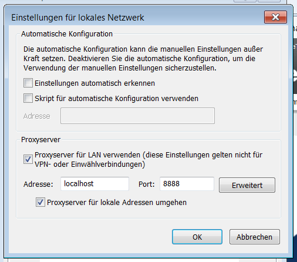

■ [.net.work](/) » [de](/de) » [2016](/de#2016)  » 9 » Proxy-Probleme mittels Fiddler umgehen

# Proxy-Probleme mittels Fiddler umgehen
_Published:_ 16.09.2016 00:00:00

_Categories_: [allgemein](/de/categories#allgemein) - [os](/de/categories#os) - [programmierung](/de/categories#programmierung) - [windows](/de/categories#windows)

_Tags_: [fiddler-de](/de/tags#fiddler-de) - [proxy-de](/de/tags#proxy-de)


Wer in einem Unternehmen arbeitet, dass eine Proxy-Authentifizierung verwendet (also die Eingabe eines Passworts zum Surfen erfordert) kennt das Problem: Einige Die meisten Anwendungen mögen keine Proxies mit Passwortabfrage. Eine dieser Anwendungen ist Visual Studio, dass an vielen verschiedenen Stellen Fehler schmeißt.

Man kann diese Fehler durch verschidene Workarounds beheben, aber im Grunde sind sie alle PITA.

Wenn man dann auch noch selbst Anwendungen entwickelt, welche Online-Zugriff benötigt, ist man ziemlich gearscht.

Nach einer langen Recherche und viel herumprobieren habe ich nun eine Lösung mittels [Fiddler](http://www.telerik.com/fiddler) gefunden. Wer (Online-)Software entwickelt, hat es oftmals ohnehin bereits installiert.

Als erstes:

Den Rechner neu starten. **Noch keine Zugangsdaten für den Proxy eintragen**. Tragt Fiddler als Systemproxy im IE ein und den echten Proxy in Fiddler:

[](http://dotnet.work/wp-content/uploads/2016/09/proxyIE.png)

Default Proxy-Settings für Fiddler

 

\[caption id="attachment\_455" align="alignnone" width="494"\][](http://dotnet.work/wp-content/uploads/2016/09/fiddlerproxy.png) Proxy-Settings in Fiddler\[/caption\]

**_Nicht "System Proxy" eintragen!_.** Sonst trägt sich Fiddler beim nächsten Start hier selbst ein.

Nun einen beliebigen Browser (außer Firefox) öffnen und eine beliebige Seite anszurfen. Das Proxypasswort sollte abgefragt werden. Eintragen und die Seite laden. Jetzt sollte im Fiddler mindestens ein Eintrag mit dem Code 407 und einem anschließenden 200 erscheinen.

[](http://dotnet.work/wp-content/uploads/2016/09/fiddler1.png)

Den ersten 200er nach dem 407er schauen wir uns jetzt an und lassen uns die Heeaders anzeigen. Unter dem Punkt "Security" ist nun eine Zeile mit "Proxy-Authorization: "... :

[](http://dotnet.work/wp-content/uploads/2016/09/fiddler2.png)

Diese Zeile nun in die Zwischenablage

Im Fiddler dann mittels Ctrl-R die Konfigurationsdatei öffnen. Folgende Zeile suchen:

```
static function OnBeforeRequest(oSession: Session) {
```

Direkt darunter folgende Zeile einfügen:

```
oSession.oRequest\["Proxy-Authorization"\] = "Basic DBDDHKPadasdkahsdasd=";
```

Wobei der Wert hinter "Basic" ersetzt werden sollte durch den Wert aus der Zwischenablage.

Jetzt nur noch die Datei speichern und ab jetzt fragt keine Anwendung, welche den Systemproxy verwendet mehr nach dem Password.

Wenn das Proxy-Passwort geändert werden muss, vorher die Zeile in der Config auskommentieren, das Passwort ändern und diese Schritte erneut durchführen.

Das wars dann eigentlich schon. Für etwas mehr Komfort kann ich noch den [proxy switcher](http://proxyswitcher.net/) empfehlen, falls der Proxy öfters mal gewechselt werden muss.
