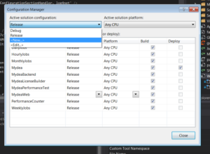
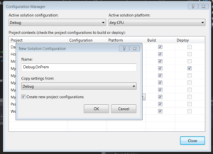
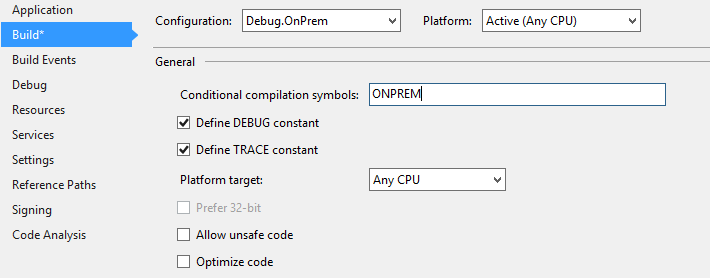

# Tanzen auf zwei Hochzeiten: SharePoint Provider-Hosted Add-Ins in Office365 & On-Premise installieren
_Published:_ 14.12.2016 00:00:00

_Categories_: [c](//de/categories#c) - [sharepoint](//de/categories#sharepoint)

_Tags_: [csom-de](//de/tags#csom-de) - [office365-de](//de/tags#office365-de) - [sharepoint](//de/tags#sharepoint) - [sharepoint2013-de](//de/tags#sharepoint2013-de) - [sharepoint2016-de](//de/tags#sharepoint2016-de) - [visual-studio](//de/tags#visual-studio)


Worum geht es überhaupt?

Ich bin zwar nicht sicher, ob ich der einzige bin, der es versucht hat, aber zumindest schein ich der erste zu sein, der darüber schreibt: Eine SharePoint Provider-Hosted Add-In zu programmieren, dass sich sowohl auf einer lokalen SharePoint-Installation, als auch in Office365 verwenden lässt.

Vielleicht ist es auch eine deutsche Besonderheit: Hier herrscht ein ziemliches Misstrauen gegenüber der Cloud, viele Kunden wollen die Daten lieber auf "ihrem" Server lagern. Office365 ist deshalb kein Thema.

Wir haben derzeit einen Kunden, dem unsere Office365.-App "[Mydea](https://store.office.com/en-001/app.aspx?assetid=WA104380251)" sehr gut gefällt. Allerdings möchte er, dass sie auf einem SharePoint 2013 installiert wird. Also hatte ich drei Optionen:

1. Sagen, dass es nicht geht
2. Die ganze Lösung kopieren und dann die Kopie so anpassen, dass sie auf dem SharePoint 2013 funktioniert
3. Irgendwas magisches anderes probieren :)

Natürlich wollte ich die erste Option auf jeden Fall vermeiden. Die zweite Lösung hätte prinzipiell funktioniert, aber zu doppeltem Pflegeaufwand geführt. Das ist unschön und macht keinen Spaß. "Mydea" ist ein Innovationstool, und als solches selbst natürlich möglichst innovativ. Das bedeutet, kurze Produktzyklen und agil entwickelt. Das doppelt pflegen zu müssen wäre die Hölle :)

Also habe ich mich für die dritte Option entschieden: Etwas Magie.Die Anwendung sollte - ohne beim (automatisierten) Ausliefern eine Zeile Code ändern zu müssen sowohl unter Office365, als auch unter SharePoint 2013 lauffähig sein.

Die übliche Antwort zu dieser Frage lautet: _Das geht nicht_. Aber es funktionert eben doch. Es ist nur ein sehr steiniger Weg um dorthin zu gelangen. Um diese Anleitung zu befolgen, solltest Du Dich bereits mit den Grundlagen im Erstellen von SharePoint-Add-Ins auskennen. Du solltest mindest ein \[bs\_tooltip placement="top" trigger="hover" title="Microsoft hat - in ihrer Weisheit- 'Apps' in 'Add-Ins' umbenannt. Wenn ich also eines von beiden schreibe, meine ich immer das Gleiche."\]Add-In\[/bs\_tooltip\] für SharePoint2013 und eines für Office365 erfolgreich deployed haben. Ich werde diese Grundlagen hier nicht erklären, und kann auch nicht auf Kommentare dazu hier oder per E-Mail antworten. Dafür ist [StackOverflow](www.stackoverflow.com), bzw. bei komplexeren Themen [SharePoint@StackExchange](http://sharepoint.stackexchange.com/) da. Es gibt aber eine gute Chance, dass ich Dir dort antworten werde :)

### Untersuchen der Unterschiede: Was muss getan werden?

Meine Reihenfolge war es zunächst eine Office365-App zu schreiben und diese dann optional in eine OnPrem-Installation zu wandeln. Diese Reihenfolge wird hier beschrieben. Die umgekehrte Reihenfolge sollte sich aber leicht durch geringe Modifikationen durchführen lassen.

Als erstes habe ich zwei Dummy "Hello World" - Projekte erstellt. Eines für O365, eines für SharePoint2013. Dann habe ich mir die Quellen angeschaut und "gedifft". Dasdurch kam ich zu folgenden Ergebnissen:

NuGet: Folgende unterschiedliche Pakete werden verwendet:

OnPrem: - AppForSharePointWebToolKit

Office 365: - AppForSharePointOnlineWebToolKit - Microsoft.SharePointOnline.CSOM

Diese Pakete führen zu verschiedenen DLLs mit dem Prefix _"Microsoft.SharePoint.Client.\*"_, aber unterschiedlichen Versionen: OnPrem: - Version 15.xxx Office 365: - Version 16.xxx

Der Quellcode der Dateien, die durch die Pakete im Projekt erstellt werden (_SharePointContext.cs_ & _Tokenhelper.cs_) ist absolut identisch. Hier müssen also keine Änderungen vorgenommen werden.

Üblicherweise werden Office-Apps in Azure gehostet, aber für eine OnPrem-Installation wäre das zwar möglich, aber meist nicht gewünscht.

Es werden auch unterschiedliche Authentifizierungsmechanismen verwendet: OnPrem: - Verwenden von Zertifikaten - Windows Authentication

Office 365: - Verwenden eines ClientSecret - OAuth Authentifizierung

Diese unterschiedlichen Authentifizierungen werden über die Web.Config eingestellt.

### Bevor wir loslegen können

**Erstelle einen neuen Branch im repository.** (oder mache ein Backup) Es kann immer etwas schief gehen :)

### Das Web-Projekt (üblicherweise MVC)

##### Unterschiedliche Build Konfigurationen

Um den gleichen Code für beide Anwendungszwecke verwendenn zu könnn (und so Änderungen/Fixes nur einmal pflegen zu müssen) benötigen wir verschiedene Build - Konfigurationen. Diese werden unter "Build - Configuration Manager" erstellt: [](http://dotnet.work/wp-content/uploads/2016/12/showBuildConfigurations.png)

Erstelle zwei Konfigurationen für OnPrem. Eine für _Debug-OnPrem_ und eine für _Release-OnPrem_. Kopiere hierfür die Einstellungen für die bereits vorhanden _Debug_ und _Release_ - Konfigurationen. [](http://dotnet.work/wp-content/uploads/2016/12/newBuildConfiguration.png)

Führe dies jetzt zunächst nur für das Web-Projekt (und falls vorhanden) die Backend-Projekte durch, die vom MVC-Projekt verwendet werden. Später kommen weitere hinzu, aber um Schrittweise die Einstellungen testen zu können, sind kleine Schritte hier besser:

[](http://dotnet.work/wp-content/uploads/2016/12/buildConfigurationShow.png)

Es ist an der Zeit, Konfigurationsdateien für die neuen Build-Konfigurationen zu erstellen. Suche die _Web.Config_ im Visual Studio, Klicke mit der rechten Maustaste darauf und wähle _"Add config transform"_. Danach sollten auf magische Weise zwei neue Konfigurationsdateien existieren.

##### Nuget-Pakete

Ich habe die PnP-Pakete für das O365-AddIn verwendet. Solltest Du stattdessen die "Basis"-Pakete verwendet haben, die Visual Studio nutzt, wenn ein neues SharePoint-Projekt erstellt wird, könnten sie bei Dir etwas anders aussehen. In jedem Fall wird aber das Paket _"AppForSharePointOnlineWebToolKit"_ vorhanden sein.

Wenn man die Pakete betrachtet, dann ist der wesentliche Unterschied, dass bei der Office365-Lösung Azure- und OAuth-Pakete enthalten sind, die in der 2013-er Version nicht verwendet werden. Außerdem haben die O365-DLLs die Version 16.x, während die OnPrem-Version 15.x verwendet.

Um Sicher zu gehen, dass der PackageManager die Pakete nicht verwirft, wenn eine andere Konfiguration verwendet wird, reicht es, zwei Dummy-Projekte anzulegen. Z.B. _dummy365_ & _dummyOnprem_. Die Art der Projekte ist egal. Sie werden ohnehin nie ausgeführt. Sie sorgen nur dafür, dass immer die Pakete für O365 und 2013 im _./packages/_ - Verzeichnis vorhanden sind. Das dummy365-Projekt sollte das O365PnP-NuGet-Package referenzieren, dummyOnPrem das 2013PnP-NuGet-Package.

Als nächsten Schritt solltest Du jetzt **ein Backup der .csproj-Datei(en) machen.** Diese enthält wichtige Informationen, die wir später benötigen.

Füge nun das "andere" PnP-Package zum WebProjekt hinzu. Wenn Du bereits das _SharePointPnPCoreOnline_\-Paket installiert hast, install nun das _SharePointPnpCore2013_ NuGet-Paket (und umgekehrt)

##### csProj-Änderungen

Du kannst jetzt die vorherige csProj-Datei mit der aktuellen vergleichen. Oder mir einfach glauben: Es gibt zwei wesentliche Änderungen. Die eine ist das _OfficeDevPnPCore_ - Paket. Der "HintPath" vom O365-Paket unterscheidet sich vom "HintPath" der 2013-Variante. Die DLLs sind dann aber wiederum identisch. Dennoch, weil wir ohnehin alles gerade ziehen, passen wir den Pfad passend zur Variante an.

Interessanter ist die Referenz zu _"Microsoft.Online.SharePoint.Client.Tenant"_. Die Office365 - Version verwendet Version 16.x und die OnPrem - Version verwendet 15.x. Das ist etwas, was wir auf jeden Fall beachten müssen.

Glücklicherweise erlauben csProj-Dateien Bedingungen. Also frisch ans Werk und folgende Zeilen eingefügt:
```
<ItemGroup Condition="'$(Configuration)'=='Debug.OnPrem' Or '$(Configuration)'=='Release.OnPrem'">
<Reference Include="Microsoft.Online.SharePoint.Client.Tenant, Version=15.0.0.0, Culture=neutral, PublicKeyToken=71e9bce111e9429c, processorArchitecture=MSIL">
<HintPath>..\\packages\\SharePointPnPCore2013.2.9.1611.0\\lib\\net45\\Microsoft.Online.SharePoint.Client.Tenant.dll</HintPath>
<Private>True</Private>
</Reference>
<Reference Include="OfficeDevPnP.Core, Version=2.9.1611.0, Culture=neutral, PublicKeyToken=3751622786b357c2, processorArchitecture=MSIL">
<HintPath>..\\packages\\SharePointPnPCore2013.2.9.1611.0\\lib\\net45\\OfficeDevPnP.Core.dll</HintPath>
<Private>True</Private>
</Reference>
</ItemGroup>

<ItemGroup Condition="'$(Configuration)'=='Debug' Or '$(Configuration)'=='Release'">
<Reference Include="Microsoft.Online.SharePoint.Client.Tenant, Version=16.1.0.0, Culture=neutral, PublicKeyToken=71e9bce111e9429c, processorArchitecture=MSIL">
<HintPath>..\\packages\\Microsoft.SharePointOnline.CSOM.16.1.5813.1200\\lib\\net45\\Microsoft.Online.SharePoint.Client.Tenant.dll</HintPath>
<Private>True</Private>
</Reference>

<Reference Include="OfficeDevPnP.Core, Version=2.9.1611.0, Culture=neutral, PublicKeyToken=3751622786b357c2, processorArchitecture=MSIL">
<HintPath>..\\packages\\SharePointPnPCoreOnline.2.9.1611.0\\lib\\net45\\OfficeDevPnP.Core.dll</HintPath>
<Private>True</Private>
</Reference>
</ItemGroup>
```

Wie man sehen kann, wurden für die unterschiedlichen Konfigurationen unterschiedliche DLLs referenziert. **Bitte nicht einfach den Code von hier per copy&paste übernehmen** Verwende die Zeilen aus **Deiner** Datei. Im Moment, wo Du diese Anleitung liest, können die Versionsnummern hier im Quellcode schon veraltet sein. Jetzt müssen nur noch die Ursprünglichen Zeilen innerhalb der "normalen" _ItemGroup_ entfernt werden, welche diese Libraries enthalten haben.

Das war es erst einmal. Du solltest nun versuchen die Solution in allen vier Build - Konfigurationen zu builden-. Die OnPrem-Konfigurationen sollten eine _Microsoft.Online.SharePoint.Client.Tenant.dll_ mit Version 15 in dem bin-Verzeichnis erzeugen und die Office365-Version eine V16-dll. Wenn es ein Problem gibt: Lade das Projekt neu. Manchmal bekommt VS Änderungen, die "außerhalb" erfolgt sind nicht richtig mit.

\[bs\_label type="info"\]Hinweis: Ich bin mir nicht sicher, ob as manuelle Bearbeiten der csProj-Datei ein Update überlebt. Es könnte als nach einem neuen Paket evtl. notwendig sein, die Datei erneut zu bearbeiten.\[/bs\_label\]

##### Web.Config

Jetzt geht es an die Web.Configs

Füge folgende Zeilen direkt vor dem _"</configuration>"_ Abschnitt in die \*.OnPrem.config - Dateien hinzu:
```
<runtime>
<assemblyBinding xmlns="urn:schemas-microsoft-com:asm.v1">
<dependentAssembly xdt:Transform="Replace" xdt:Locator="Condition(./\_defaultNamespace:assemblyIdentity/@name='Microsoft.Online.SharePoint.Client.Tenant')">
<assemblyIdentity name="Microsoft.Online.SharePoint.Client.Tenant" publicKeyToken="71e9bce111e9429c" culture="neutral" />
<bindingRedirect oldVersion="0.0.0.0-15.0.0.0" newVersion="15.0.0.0" />
</dependentAssembly>
</assemblyBinding>
</runtime>
```

Wie vorher: Beim Zeitpunkt des Schreibens ist die Version 15.0 die aktuellste. Beim Zeitpunkt des Lesens, kann sie höher sein.

Ähnliches wird nun mit den "normalen" Configs durchgeführt:
```
<runtime>
<assemblyBinding xmlns="urn:schemas-microsoft-com:asm.v1">
<dependentAssembly xdt:Transform="Replace" xdt:Locator="Condition(./\_defaultNamespace:assemblyIdentity/@name='Microsoft.Online.SharePoint.Client.Tenant')">
<assemblyIdentity name="Microsoft.Online.SharePoint.Client.Tenant" publicKeyToken="71e9bce111e9429c" culture="neutral" />
<bindingRedirect oldVersion="0.0.0.0-16.1.0.0" newVersion="16.1.0.0" />
</dependentAssembly>
</assemblyBinding>
</runtime>
```

### Authentifizierung

Die O365-Config-Dateien (Die ohne Suffix) sollten folgenden Inhalt haben:
```
<appSettings>
<add key="ClientValidationEnabled" value="true" />
<add key="UnobtrusiveJavaScriptEnabled" value="true" />
<add key="ClientId" value="aaaaaaaa-beef-face-bbbb-cchcchcchcch" />
<add key="ClientSecret" value="lsdschnabbeldiwuppsfkjashriuae=" />
</appSettings>
```

Die OnPrem-Configs müssen hingegen etwas anders aussehen:
```
<appSettings>
<add key="ClientValidationEnabled" value="true" />
<add key="UnobtrusiveJavaScriptEnabled" value="true" />
<add key="ClientId" value="aaaaaaaa-beed-face-bbbb-cchcchcchcch" />
<add key="ClientSigningCertificatePath" value="C:\\Certs\\myCert.pfx" />
<add key="ClientSigningCertificatePassword" value="p@ssw0rd" />
<add key="IssuerId" value="bbbbbbbb-beef-face-bbbb-cchcchcchcch" />
</appSettings>
```

Der wesentliche Unterschied ist, dass die ClientId/ClientSecret - Kombination nur im O365-Umfeld funktioniert. Für die OnPrem-Installation hingegen benötigen wir ein Zertifikat. (Wie genau das Zertifikat zu erzeugen und einzubinden ist werde ich hier nicht beschreiben, das haben [andere](https://msdn.microsoft.com/en-us/library/office/fp179901.aspx) schon sehr ausführlich getan.) Bitte darauf achten: Die ClientId ist **nicht** das Gleiche wie die IssuerId.

### Backend, Webjobs und andere Projekte, die mit SharePoint kommunizieren

##### App.Config

Falls noch weitere Projekte vorhanden sind, die mit SharePoint kommunizieren, sind hierfür einige zusätzliche Schritte notwendig. Ignoriere dieses Kapitel, wenn dies nicht der Fall ist.

Leider funktionieren Config-Transformationen nut mit Web.Configs. Andere Konfigurationen (App.Config) sind etwas anspruchsvoller. Aber wir kriegen das schon hin :)

Als erstes die zusätzlichen Configs manuell erzeugen vie "Add - New Item " und in der Maske dann "_Application Config File_". Nenn die Datei _App.OnPrem.config_. Öffne dann die Config-Datei mit Notepad. Suche nach einer _ItemGroup_ welche die App.Configs enthält. Es sollte bereits Einträge mit _App.Debug.config_ und _App.Release.config_ geben, die ein "_DependentUpon_" - Attribut besitzen. Kopiere einfach den ganzen Tag, so dass folgendes herauskommt:

```
<ItemGroup>
<None Include="App.config" />
<None Include="App.Debug.config">
<DependentUpon>App.config</DependentUpon>
</None>
<None Include="App.Debug.OnPrem.config" >
<DependentUpon>App.config</DependentUpon>
</None>
<None Include="App.Release.OnPrem.config" >
<DependentUpon>App.config</DependentUpon>
</None>
<None Include="App.Release.config">
<DependentUpon>App.config</DependentUpon>
</None>
</ItemGroup>
```

Im Visual Studio (Solution neu laden) sollten die neuen Configs nun als Unterelement der App.Config angezeigt werden. After that all your OnPrem-Configs should be displayed as children from App.Config in Visual Studio (2015). Prüfe jetzt die csproj-Datei. Ab Visual Studio 2015 wars das und _<UsingTask TaskName="TransformXml" ../>_ sollte dort irgendwo stehen. Falls nicht, sind ein paar [extra Schritte notwendig](http://harrewijnen.net/app-config-xdt-transforms/).

Der nächste Schritt ist wie bei der Web.Config, was ClientId & Co angeht. Zusätzlich muss die transform Property zu _configuration_ hinzugefügt werden:

<configuration xmlns:xdt="http://schemas.microsoft.com/XML-Document-Transform">

### Und noch mal testen

Erstelle alle Projekte in allen Configs. Prüfe wieder die DLLs. Das deployen auf Office365 sollte weiterhin funktionieren.

### Änderungen am App-Projekt

Jetzt geht es um das Hauptprojekt (Ohne den Suffix "Web")

Füge bei den Build-Configurationen für OnPrem (siehe Screenshots oben) jetzt auch dieses Projekt hinzu. Über die Configs brauchen wir uns diesmal keine Sorgen machen, da das Projekt keine externen Bibliotheken referenziert.

##### SharePoint - URL

Wir nähern uns dem Zieleinlauf :) Abhängig von der Konfiguration wird die SharePoint-Url eine andere sein bei Office365 oder OnPrem. Man kann das vor dem Debuggen jedes Mal händisch ändern. Oder man macht es gleich richtig.

Die Url befindet sich hier nicht in den Projekteinstellungen, sondern in den User-Einstellungen. Es lassen sich aber die gleichen Bedingungen verwenden. Öffne also die Datei _YourApp.csproj.user_ und füge die Bedingungen hinzu:
```
<PropertyGroup>
<SharePointSiteUrl Condition="'$(Configuration)'=='Debug.OnPrem' Or '$(Configuration)'=='Release.OnPrem'">http://myDevMachine:10000/sites/Dev\_Ole/</SharePointSiteUrl>
<SharePointSiteUrl Condition="'$(Configuration)'=='Debug' Or '$(Configuration)'=='Release'">https://my365AppName.sharepoint.com/sites/dev-ole/</SharePointSiteUrl>
</PropertyGroup>
```

(Natürlich solltest Du da **deine** Serveradressen eintragen :) ) Leider werden dies Änderungen nicht automatisch übernommen. Kein Problem beim automatischen Build, aber zum Debuggen muss das Projekt einmal neu geladen werden, um die Einstellungen zu übernehmen.

##### Office-Version

Die csproj - Datei besitzt einen Eintrag namens "_TargetOfficeVersion_" der noch den Wert "16.1" haben sollte. Wieder verwenden wir die Bedingungen:
```
<TargetOfficeVersion Condition="'$(Configuration)'=='Debug' Or '$(Configuration)'=='Release'">16.1</TargetOfficeVersion>
<TargetOfficeVersion Condition="'$(Configuration)'=='Debug.OnPrem' Or '$(Configuration)'=='Release.OnPrem'">15.0</TargetOfficeVersion>
```

Ob die Einstellung korrekt ist, lässt sich in den Projekteinstellungen ablesen im "SharePoint"-Tab. Die "Target Sharepoint version" sollte entweder "SharePoint 2013" oder "SharePoint Online" anzeigen, je nach gewählter Build Konfiguration.

##### Und noch einmal Authentifizierung

Office365 verwendet OAuth als Authentifizierung. Für SharePoint 2013 muss hingegen Windows Authentifizierung verwendet werden. As I wrote before: There are a few documents out there explaining the Certificate-Part. Es ist mal wieder Zeit für unseren Freund, die "Condition":
```
<IISExpressWindowsAuthentication Condition="'$(Configuration)'=='Debug.OnPrem' Or '$(Configuration)'=='Release.OnPrem'">enabled</IISExpressWindowsAuthentication>
<IISExpressWindowsAuthentication Condition="'$(Configuration)'=='Debug' Or '$(Configuration)'=='Release'">disabled</IISExpressWindowsAuthentication>
```

##### AppManifest

Das Appmanifest erlaubt leider keine Bedingungen. Deshalb müssen wir eine Kopie anlegen und die unterschiedlichen Dateien in der csproj konfigurieren. Erstelle also zunächst eine Kopie "AppManifest.OnPrem.xmlns"

In dieser Datei ändern wir dann "SharePointMinVersion" von _16.0.0.0_ auf _15.0.0.0_ in der "_App_"-Sektion.

Und wieder zurück zur csproj. Du solltest es mittlerweile im Schlaf können :)
```
<ItemGroup Condition="'$(Configuration)'=='Debug.OnPrem' Or '$(Configuration)'=='Release.OnPrem'">
<AppManifestFile Include="AppManifest.OnPrem.xml">
<SubType>Designer</SubType>
</AppManifestFile>
</ItemGroup>
<ItemGroup Condition="'$(Configuration)'=='Debug' Or '$(Configuration)'=='Release'">
<AppManifestFile Include="AppManifest.xml">
<SubType>Designer</SubType>
</AppManifestFile>
</ItemGroup>
```

Fertig :)

## Limitierungen in SharePoint 2013

Die meisten Methoden sind in beiden Versionen identisch. Es gibt aber einige wenige Beispiele, die sich unterscheiden. Folgende Limitierungen sind mir bei meinem Projekt aufgefallen: - FieldUserValue hat keine Property "Email" - Microsoft.Client.SharePoint.Folder hat keine Methode "Exists()"

### Benutzerdefinierte Compiler-Symbole

Wegen der kleinen Unterschiede möchtest Du evtl. Teile des Codes je nach Version unterschiedlich implementieren. Wie das automatische DEBUG-Symbol, lassen sich auch weitere, eigene Symbole erzeugen. Öffne einfach die Eigenschaften der betroffenen Projekte, wähle den Build-Tab und unter "_Conditional compilation symbol_s" kann der Wert "_ONPREM_" (oder jeder beliebige andere) eingetragen werden:

[](http://dotnet.work/wp-content/uploads/2016/12/symbol.png)

Hinterher kann im Code dieses Symbol verwendet werden und unterschiedliche Herangehensweisen umzusetzen:
```
#if OnPrem
var userMail=GetMailFromUser(fieldUserValue); 
#else 
var userMail=FieldUserValue.Email;
#endif
```

## Ende gut, alles gut

Das wars. Falls das Projekt noch Azure-Komponenten verwendet (z.B. for caching, insights, blob-storage), wirst Du Dich darum vielleicht auch kümmern müssen. Das Compiler-Symbol "ONPREM" sollte Dir dabei helfen.

Herzlichen Glückwunsch! Du hast geschuftet, geflucht (garantiert), aber es schlussendlich doch geschafft (hoffentlich): Dein Add-In läuft sowohl unter Office365, als auch unter SharePoint 2013. \\o/
