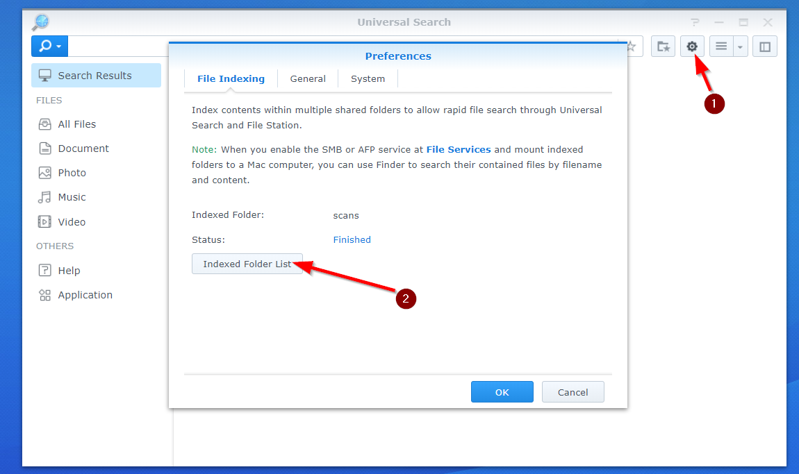
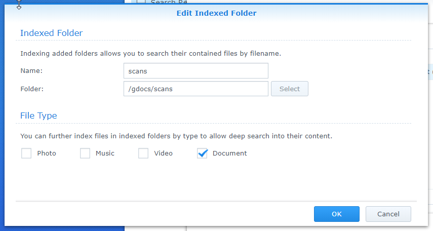
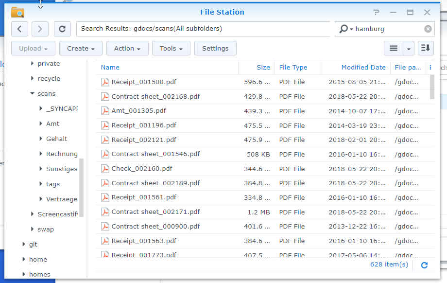

# Nextcloud anstatt Google Drive/One auf der Synology. Schritt 2: Suchen auf dem NAS
_Published:_ 07.11.2018 00:00:00
_Categories_:[allgemein](/dotnetwork/de/categories#allgemein)

Wenn das OCR erfolgreich gelaufen ist, kann man bereits auf dem Synology direkt nach den Inhalten suchen. Dafür muss dem NAS aber mitgeteilt werden, dass die entsprechenden Verzeichnisse indiziert werden müssen. Die Indizierung geht übrigens auch bei ein paar tausend PDFs sehr schnell.

Zuständig dafür ist das Paket "Universal Search".

Wenn es noch nicht installiert ist, einfach über den Paketmanager aktivieren. Nach Start der App kann über das Zahnrad in die Einstellungen gewechselt werden. Über einen Klick auf "Indexed Folder List" kann man dann neue Verzeichnisse hinzufügen:

Hier nun das Verzeichnis wählen, einen Namen aussuchen und als Typ "Document" auswählen.

Nachdem die Indizierung abgeschlossen ist, kann man bereits in der "Universal Search" eine Volltextsuche durchführen. Man kann ab jetzt aber auch direkt im Filemanager danach suchen. Da in den ganzen Rechnungen und Verträgen meine Adresse in Hamburg steht werden diese nun auch alle gefunden:

 

Das wars schon.
