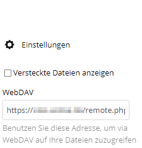
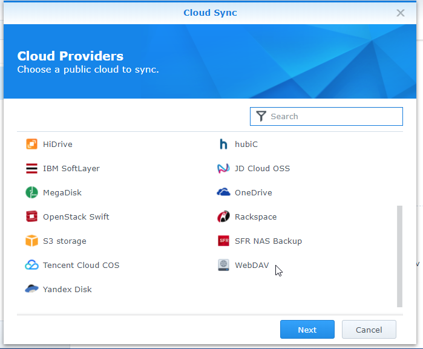
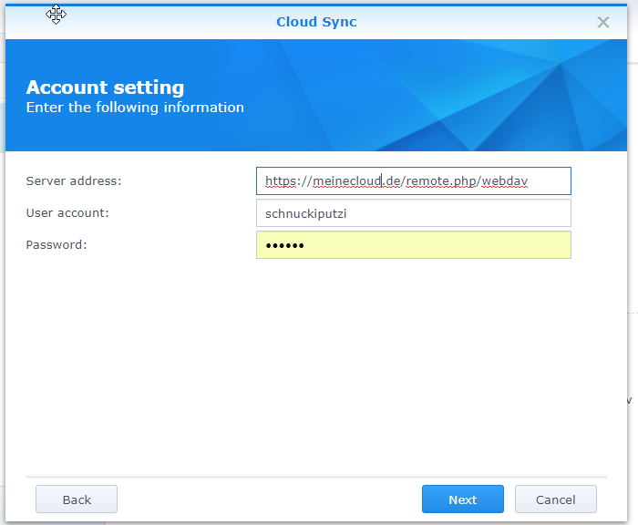
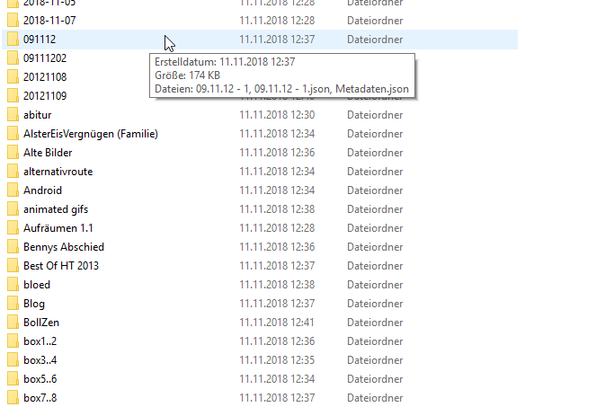
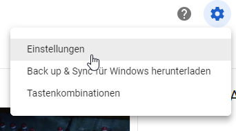
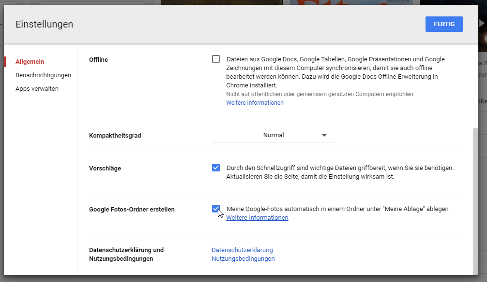
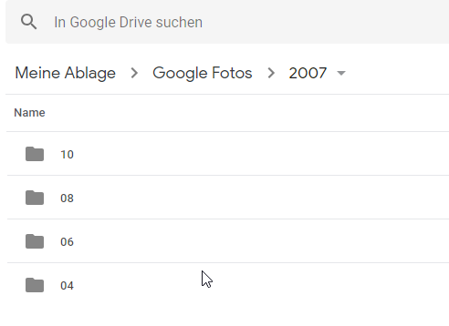
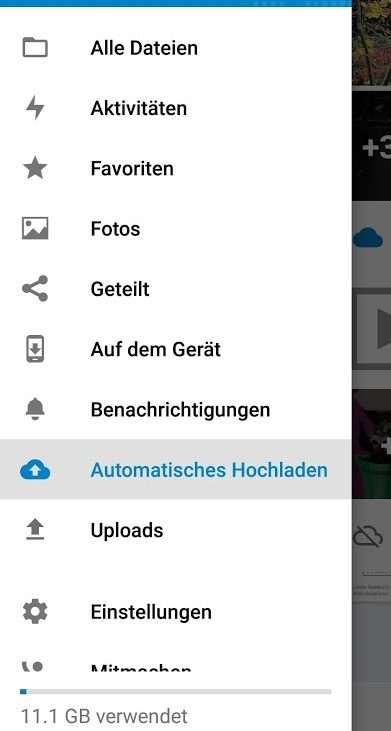
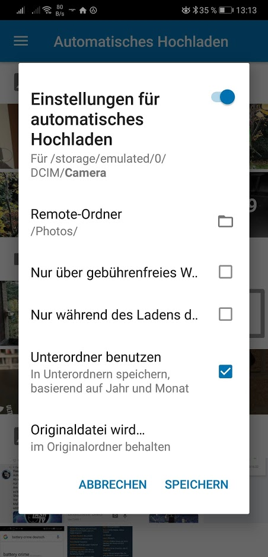

■ [.net.work](/) » [de](/de) » [2018](/de#2018)  » 11 » Nextcloud anstatt Google Drive/One auf der Synology. Schritt 3: Sync & Bilder

# Nextcloud anstatt Google Drive/One auf der Synology. Schritt 3: Sync & Bilder
_Published:_ 11.11.2018 00:00:00

_Categories_: [anwendungen](/de/categories#anwendungen)

_Tags_: [google-drive](/de/tags#google-drive) - [google-keep](/de/tags#google-keep) - [google-one](/de/tags#google-one) - [google-photos](/de/tags#google-photos) - [nextcloud](/de/tags#nextcloud) - [owncloud](/de/tags#owncloud)

# Sync OwnCloud-NAS

Das Synchronisieren mit OwnCloud ist relativ einfach, vor allem wenn man vorher schon ähnliches mit Google Drive eingerichtet hatte. Due Synchronisation erfolgt mittels WebDAV. Die Adresse hierfür kann in Owncloud unter Einstellungen angezeigt werden. Diese Adresse per Copy&Paste merken:

Im Anschluss kann diese Adresse dann in der "Cloud Station" von der Synology eingetragen weden:

**Wichtig**: Bei der "Server address" muss am Ende der Slash ("/") entfernt werden, sonst kommt Synology mit der URL nicht klar. Hat ewig gedauert, bis ich das herausgefunden habe und dieser Hinweis war auch nirgends im Internet zu finden (bis jetzt  😎)

Wenn alles klappt, sollte jetzt die Synchronisierung automatisch anfangen.

_Hinweis;_ Ich hatte gewaltige Diskrepanzen in der Anzeige in Sachen Speicherverbrauch Google Drive/Lokale Festplatte/Owncloud. Es waren aber dann doch alle Dateien vorhanden.

 

# Google Photos

## Sichern und Übertragen

Es gibt zwei Möglichkeiten, die Photos aus _Google Photos_ zu sichern. Option eins ist [Google Takeout](https://takeout.google.com/settings/takeout). Hier werden sämtliche Fotos und Alben als ZIP-Archiv exportiert. Pro Album gibt es ein Verzeichnis, welches dann Bilder und Meta-Informationen als Json enthält. Zusätzlich wird pro Aufnahmetag ein weiteres Verzeichnis erstellt. Das führt dadurch auch zu Duplikaten. Meine 20GB an Photos wurden so zu 35GB durch die Redundanz.

Eine zweite Möglichkeit ist es, die Photos direkt zunächst in Google Drive zu exportieren. Hierzu auf die Einstellungen gehen und "Fotos exportieren" auswählen.

Dadurch wird ein neuer Ordner "Google Photos" erstellt, der dann die Bilder in der Verzeichnisstruktur "Google Photos\[Jahr\]\[Monat\]" enthält, was praktischerweise auch der Struktur der Nextcloud-App entspricht (s.u.)

Das geht überraschenderweise sehr schnell, so dass ich annehme, dass es intern bereits alles darum liegt und der "Export" nur das Verzeichnis anzeigt.

Die für mich beste Lösung war eine Kombination aus beiden Methoden. Ich habe zunächst alle Bilder mit der zweiten Methode schön übersichtlich sortiert nach Jahr & Monat exportiert und dann in Owncloud importiert. Dann habe ich zusätzlich diejenigen Alben, die ich auch als Album behalten wollte (und nicht etwa automatische Alben oder "ein Album pro Tag" ebenfalls hoch geladen. Es empfiehlt sich, den automatischen Ordner "Photos" in OwnCloud zu verwenden.

("Hochladen" bedeutet hier natürlich: In den entsprechenden Ordner auf dem NAS kopieren. Die Synchronisation erledigt ja automatisch den Rest)

## Sync mit dem Smartphone

 

(Das folgende bezieht sich auf Android, mit IOS wirds aber ähnlich funktionieren):

Die kostenlose App NextCloud bietet neben komfortablen Zugriff auf die Inhalte der eigenen Cloud auch die Möglichkeit, Bilder automatisch in die Cloud zu synchronisieren (so wie Google Photo es macht). Über "Automatisches Hochladen" kann man im Anschluss das Verzeichnis für den Speicherort der Kamera auswählen. Der Haken "Unterordner benutzen" sorgt dafür, dass die Bilder in die Struktur "Jahr\\Monat" eingefügt werden. Als Zielordner sollte "Photos" verwendet werden.

