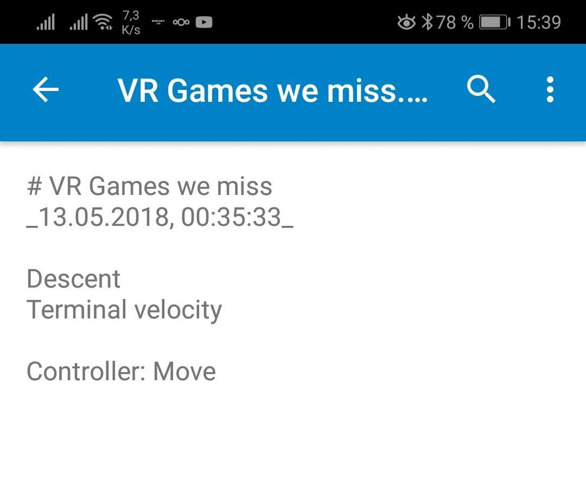
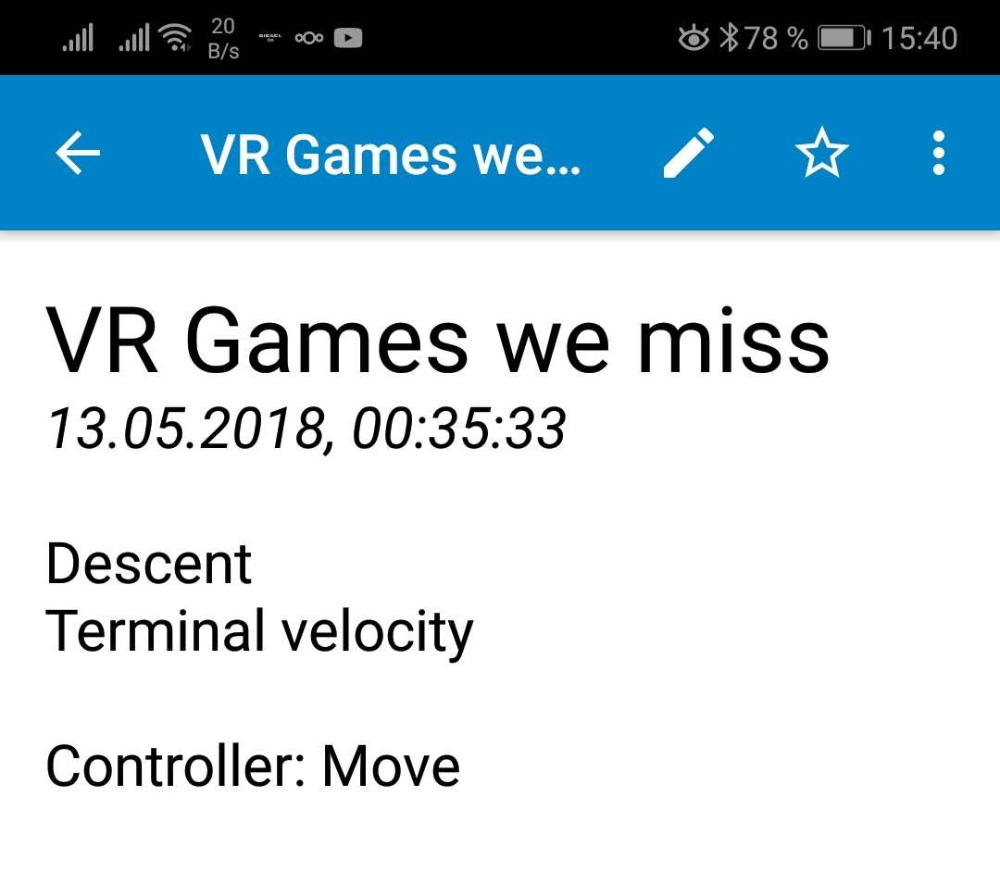

# Nextcloud anstatt Google Drive/One auf der Synology. Schritt 4: Notizen
_Published:_ 12.11.2018 00:00:00
_Categories_:[allgemein](/dotnetwork/de/categories#allgemein) - [anwendungen](/dotnetwork/de/categories#anwendungen)
_Tags_:[google-keep](/dotnetwork/de/tags#google-keep) - [nextcloud](/dotnetwork/de/tags#nextcloud) - [notes](/dotnetwork/de/tags#notes) - [notizen](/dotnetwork/de/tags#notizen) - [owncloud](/dotnetwork/de/tags#owncloud)

Nachdem die Daten von Google Drive und Google Photos ihren Weg in die eigene Wolke gefunden haben, sind als (zunächst) letzter Schritt die Notizen aus Google Keep dran. Wie bereits bei den Photos lassen diese sich über die [Takeout](https://www.google.com/settings/takeout)\-Funktion exportieren. Hier wird als Option lediglich html angeboten.

Pro Notiz wird dabei eine HTML-Datei erzeugt. Diese lässt sich dann bereits in OwnCloud einfügen und man hat als "Archiv" jederzeit Zugriff auf alte Notizen. Möchte man hingegen die Notizen auch noch weiter bearbeiten, so müssen sie in das Markdown-Format konvertiert werden. Hierzu gibt es ein kleines Online-Tool namens [keep2md](https://jsfiddle.net/95mpder7/1/). ([Quellcode](https://gitlab.com/olealbers/googlekeep2markdown))

Die Bedienung ist denkbar einfach. Einfach über den Knopf "Dateien auswählen" eine oder mehrere HTML-Dateien aus Google Keep wählen. Durch einen Klick auf "convert" wird aus jeder einzelnen Datei dann eine Markdown-Datei mit dem gleichen Inhalt erstellt. Es gibt lediglich zwei kleine Einschränkungen: Eine evtl. gesetzte Hintergrundfarbe wird ebenso wenig übernommen, wie eingefügte Bilder.

Hier sollte man übrigens auf den Browser achten: Chrome beispielsweise erlaubt maximal 10 Downloads am Stück, während Firefox auch größere Mengen erlaubt.

Sind alle Markdown-Dateien erstellt (Erkennbar an der Endung .md) können sie in den "Notes"-Ordner der Owncloud abgelegt werden. Wer möchte kann hier (im Gegensatz zu Keep) auch Ordner als Kategoriesortierung anlegen. Im Anschluss lassen sich die Dateien direkt im Browser mit der Notizapp bearbeiten.

Mobil lassen sich die Notizen mit der [Nextcloud](https://play.google.com/store/apps/details?id=com.nextcloud.client)\-App (ohne Formatierung) anzeigen:

 

Wer sie auch mobil bearbeiten möchte, kann ein paar Euro in [NextCloud Notes](https://play.google.com/store/apps/details?id=it.niedermann.owncloud.notes) investieren, hat dafür aber eine komfortable Möglichkeit, die Notizen zu bearbeiten.

. Zusätzlich kann natürlich ein beliebiger Markdown-kompatibler Editor verwendet werden. Dank der Owncloud/Nextcoud - App werden auch hier die Notizen automatisch synchronisiert.
