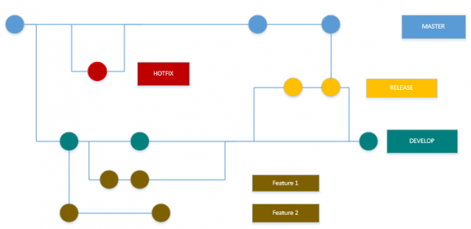
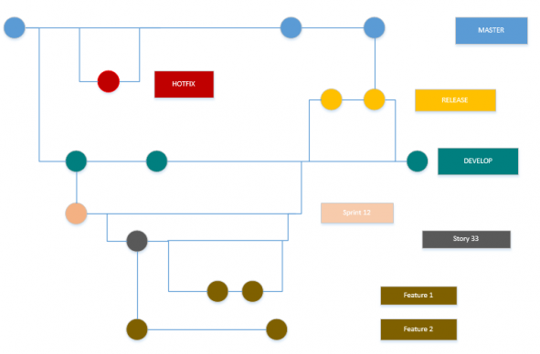

■ [.net.work](/) » [en](/en) » [2015](/en#2015)  » 3 » SCRUM and Git: Optimized Gitflow // with a lot of fancy colors :)

# SCRUM and Git: Optimized Gitflow // with a lot of fancy colors :)
_Published:_ 04.03.2015 00:00:00

_Categories_: [development](/en/categories#development)

_Tags_: [git-en](/en/tags#git-en) - [scrum-en](/en/tags#scrum-en)

For a lot of teams, GIT is the first choice for maintaining the code. So it is for mine. But this post isn't limited to GIT and should work with SVN or TFS with little modifications, too.

## Why is the Git flow important when using SCRUM?

Aren't those just two worlds, anyway?

Well. Kind of. But while SCRUM is quite flexible, scrums paradigm still has some very basic contents when it comes to manage projects:

- You and your team work in sprints.
- Inside these sprints there are user-stories you want to implement.

We decided to map sprints and user stories to our git flow.

## Classic git flow:

You usually have the following structure in a git flow: (More fancy description and image at [Atlassian](https://www.atlassian.com/git/tutorials/comparing-workflows/gitflow-workflow))

You always got your master branch. From that branch you create single branches for each Hotfix. Your daily work is done in feature branches that start at the development branch. When a feature is finished, you merge it into your development branch. For a release, the development branch (which contains the added features) is the root of a new Release\-branch. That release is tested and maybe modified until it fits the needs of your customer. When you are happy with that release you merge it back into the development branch as well as the master branch.

## "Scrumified" Git Flow:

When trying to put SCRUM into the flow you keep your basic structure but add **two additional layers** to it. The single features are not created directly from the development branch. Instead at first for each sprint a new branch is created from the development branch. From the sprint there are branches created from each user story. After you've done that, the features are created from the corresponding stories. Merging back goes the same way. You merge your features back into the user story and the user story back into the sprint before merging the sprint back into your development branch.

This is a bit more work (and might look a little bit chaotic on these pictures at first) but it offers the advantages you have from "normal" git flow also to your sprint. Like before you only merge features that are finished. But now you also only merge user stories that are complete. And as a small bonus you can always analyze which user story was started and finished in which sprint. A Win-Win-situation like those unlikable marketing guys would call it. (If they were able to understand a single word I just wrote here) :)
