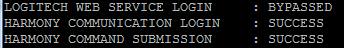
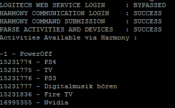
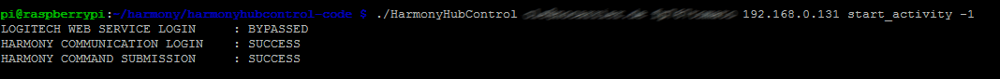

# Control your Harmony Hub with a Raspberry Pi (Linux)
_Published:_ 15.01.2016 00:00:00

_Categories_: [linux-en](/dotnetwork/en/categories#linux-en) - [operating-systems](/dotnetwork/en/categories#operating-systems)

_Tags_: [home-automation](/dotnetwork/en/tags#home-automation) - [raspberry-pi](/dotnetwork/en/tags#raspberry-pi)


[So my surveillance cam now only records when I am not at home](http://dotnet.work/2016/01/automate-your-synology-surveillancestation-with-some-simple-linux-commands/). But what if I forget to turn off the TV? That should happen automaticly, too! But fear not: There is a solution - at least if you own a harmony hub. With the help of the "HarmonyHubControl" - tool (written in c++) this is done quite easily.

First of all you need to put the source onto the Raspberry. Don't be afraid. No rocket science here. All needed tools should be already on your Linux distribution. The easiest way would be to clone the source via git:
```
git clone git://git.code.sf.net/p/harmonyhubcontrol/code harmonyhubcontrol-code
```

If you prefer you may - of course - also use the long way and download those files in a zip file.

Now after you have the source code on your Pi you have to compile it. Done with ease. Just a single

```
make
```

and you created the file "HarmonyHubControl" in that directory. Now all you need to know is the IP-address from your hub. You usually can find it in your WiFi-Router under the name "HarmonyHub"

Let's try if the connection works:

```
./HarmonyHubControl \[Login\] \[Password\] \[Ip\]
```

**Warning!** Double-check your password. If you enter a wrong one, you can still stert the activities, but on the next login in your "MyHarmony"-application you will be thrown out for a while. Don't ask why this works this way. Better ask Logitech instead.

The Login is your email-address. If username and password are right you should see the following result: [](http://dotnet.work/wp-content/uploads/2016/01/hh1.png)

So let's list all activities:
```
./HarmonyHubControl \[Login\] \[Password\] \[Ip\] list\_activies
```

[](http://dotnet.work/wp-content/uploads/2016/01/HH2.png) As you can see there is an activity with the id "-1". This activity shuts down all devices. For testing let's just start an activity:
```
./HarmonyHubControl \[Login\] \[Password\] \[Ip\] start\_activity 15231836
```

does start the FireTV in my case,
```
./HarmonyHubControl \[Login\] \[Password\] \[Ip\] start\_activity -1
```

does shut em all down.

[](http://dotnet.work/wp-content/uploads/2016/01/hh3-1.png) If you want to, do some fancy stuff with that possibilities. Use your stereo as an alarm clock? Have fun! (your neighbours, too, btw) :)
