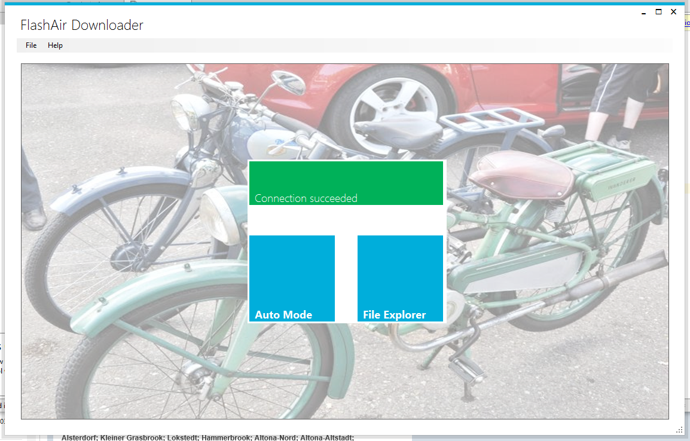
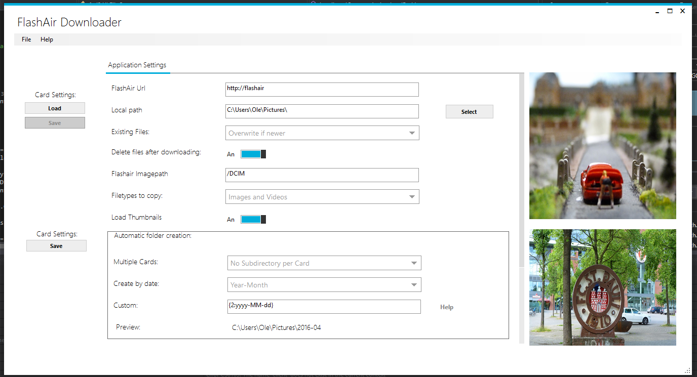
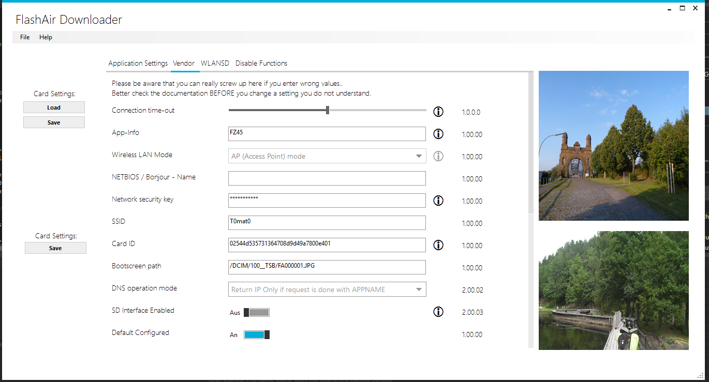
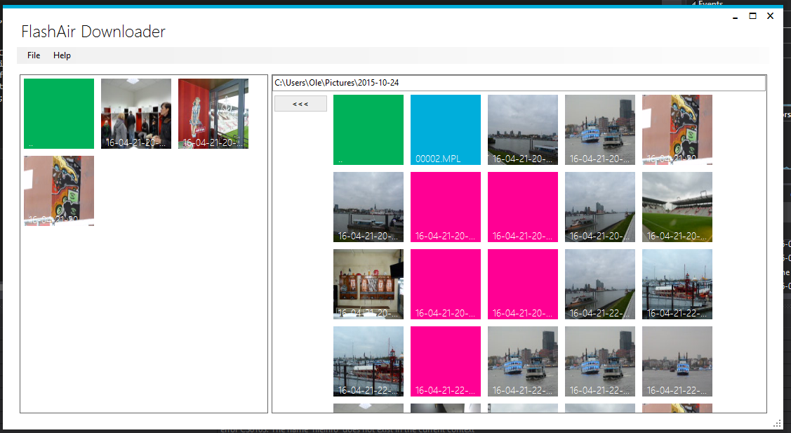

# FlashAirDownloader 2
_Published:_ 01.05.2016 00:00:00

_Categories_: [applications](/en/categories#applications) - [csharp](/en/categories#csharp) - [windows-en](/en/categories#windows-en)

\[bs\_notification type="warning"\]**Development stopped!** [Please read this](http://dotnet.work/2017/01/flashairdownloader-development-now-its-your-turn/) before downloading FAD\[/bs\_notification\]

\[bs\_notification type="info"\]Keep your Version updated! Always click onto the "Check for Updates" in the Program after installation\[/bs\_notification\]

The FlashAirDownloader 2 is out there (Because of my Laziness I will just call it FAD from now on)

A lot of people used the FlashAirDownloader which was meant as a personal tool and quick hack to access my Toshiba FlashAir Card. As more and more people asked me for features (and some for the code) I decided to make it open source so more folks can help improve the tool.

Sadly so: The code was a mess. As I told you: Just a quick hack. It would be to embarrassing to make this public :D So I decided to rewrite it from scratch: This time making it right regarding code quality and UI design. Nonetheless this program still uses Framework 4.0, cause I know there are Windows XP users out there who have no other possibilities to access the FlashAir.

But enough of talk. Here is the new FAD:

You can [download the source directly from Github](https://github.com/OleAlbers/fad2). Feel free to make the code better. Or download the binary here:

\[wpdm\_package id='368'\]

**You will get an annoying amount of warnings from your browser and/or operating system. This is because the file isn't signed. Valid signing requires a valid certificate which does not come for free. (and requires some amount of work) Feel free to build from source in GitHub if you have any doubts.** 

## First start

After Installation and starting FAD you should see something like this:

If your FlashAir - card is already configured it should be found and the display should change to this:

For now: Keep calm and do not click on any of the blue squares. Use "File/Settings" instead.

## Setup

### Program Settings

Check if your settings are ok. Here is a small description from the settings:

- FlashAir Url This is the Url from your FlashAir. You can try if you can access your FlashAir by entering that address into your Browser
- Local Path Here the Images will be saved when using the Auto-Mode
- Existing Files (Auto mode) Decide what to do if the file already exists.
- Delete files after downloading (Auto mode) If checked, the files will be deleted after a successful download from the FlashAir
- Flashair Imagepath Where your Images are located (may contain subfolders)
- Filetypes to copy (Auto mode) Decide if you only want image files or other files, too
- Load Thumbnails If enabled Thumbnails from Images on the FlashAir will be collected and shown. Might take a while. Thumbnails for local files are always displayed regardless of this setting.
- Automatic folder Creation (Auto Mode) \* Multiple Cards Use your Card ID or AppID to create subfolders if you use more than one card \* Create By Date Decide in what format the directories should be named \* Custom You can als create your own custom path. {0} stands for the CardId, {1} for the AppId and {2} for the current date. Examples about the date-format [can be found here](http://www.csharp-examples.net/string-format-datetime/)
- Styling Decide if (and what) images should be displayed on the start page and the settings page of FAD.

Don't forget to click onto \[Save\] under Card Settings in the lower left area of the screen.

### Card Settings

Now after the application is set up it is time to check your FlashAir-Card. Just put your SD-Card into the computer and click onto \[Load\] in the upper left corner. After a few seconds three new tabs should appear: "Vendor", "WLANSD" and "Disable Functions"

Click onto "Vendor" to setup the most important settings. I will only describe the most critical values. A complete list is available [at the Toshiba FlashAir Website.](https://flashair-developers.com/en/documents/api/config/)

First make sure the Connection Timeout is correct. It must be at least 1 Minute. You can also set it to "0" to disable timeout completely. "App-Info" and "Card ID" can be modified if you want to use those values in the automatic folder creation.

If your Network settings already work, don't touch them here. Otherwise [follow the instructions on the FlashAir website.](https://www.toshiba.co.jp/p-media/wwsite/flashair.htm)

Now make sure the "Upload Directory" fits the "Flashair Imagepath" in the "Application Settings".

The last setting to check is "Upload Enabled". This is required if you want to be able to save files onto the Flashair or want to delete files after downloading.

Now all you have to do is to click \[Save\] in the upper Left region and FAD is ready to go.

For the first run I would advice just keeping your card in your card-reader. It works exactly there like in your camera, but you can modify your settings more easy this way.

### Auto - Mode

After FAD found your card click onto "Auto Mode" to start automatic downloading of your data:

At first the files are loaded recursively from your card. In the next step (if activated) the thumbnails gets downloaded. Then the files are being downloaded and deleted (if selected).

If the thumbnails cannot be retrieved red squares are displayed instead.

### File Explorer

The file explorer does not download automatically images from the Flashair. Instead you can browse through your card and copy files manually. Just mark them by clicking and select the \[<<\] or \[>>\] - Button to copy them#

### Known issues

https://www.youtube.com/watch?v=PtXtIivRRKQ

 

The FlashAir is sometimes a bit unstable (at least mine). There are a lot of reasons why something goes wrong. That's why FAD tries up to five times to download or upload data. (Just Thumbnails are only tried once). There are many reasons why a download does not work. There can be a timeout, the Card can "crash" (it is a webserver running on it) or the camera just goes into standby. So often the best solution is to try again and or restart the camera and re-enter the FlashAir.

### Any more questions?

Just look at the documentation on GitHub or open an issue there if you encounter any problems.

Love it?

Feel free to send some money to my Panama-Account

      
