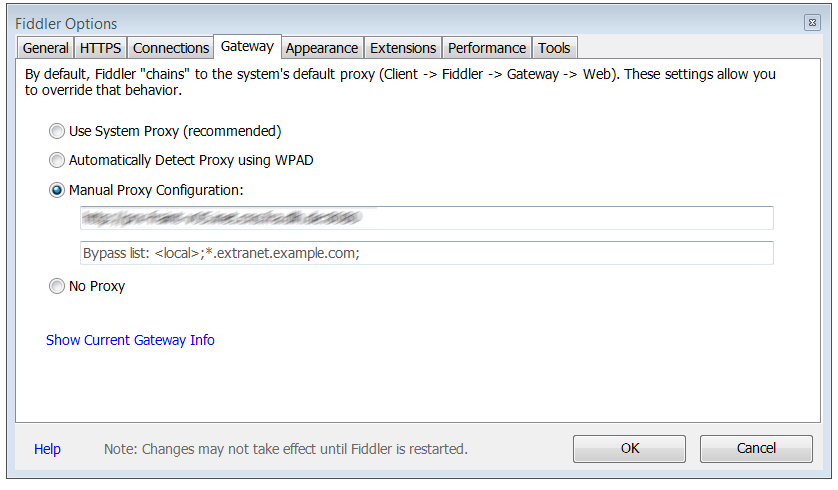

■ [.net.work](/) » [en](/en) » [2016](/en#2016)  » 9 » Getting rid of Proxy limitations using Fiddler

# Getting rid of Proxy limitations using Fiddler
_Published:_ 16.09.2016 00:00:00

_Categories_: [others](/en/categories#others)

_Tags_: [fiddler](/en/tags#fiddler) - [proxy](/en/tags#proxy)

If you work in a company that uses Proxy authentication (aka forces you to enter a password to access websites) and are a developer you know my pain: Some Most applications just don't really like proxies. Visual Studio itself for example does not like proxy authentication at all and responses with a wide variety of error codes (407 for example).

You can get rid of all these errors through different workarounds, but these are a real PITA.

In addition the application you code itself needs Internet access, for example if you develop Office365 AddIns, you are very much screwed.

After a long research I finally found a solution using [Fiddler](http://www.telerik.com/fiddler).

Most developers already use Fiddler for debugging reasons so there isn't even any software that needs to be installed.

First of all:

Start your computer. You should **not** have been entered your Proxy credentials yet. Use Fiddler as proxy in your IE and enter your real Proxy in Fiddler:

\[caption id="attachment\_454" align="alignnone" width="268"\] Default Proxy-Settings to use Fiddler\[/caption\]

\[caption id="attachment\_455" align="alignnone" width="494"\] Proxy-Settings in Fiddler\[/caption\]

 

**Do not select "_System Proxy"_.** Otherwise. Fiddler will enter itself here, because Fiddler is the System Proxy right now.

Now open your favorite browser (except FireFox, as it uses its own proxy) and open any site that opens up the Proxy authentication window. Enter your credentials and load that site. In Fiddler you should now see (at least) one entry with response code 407 followed by a few entries with 200:

Select the entry with StatusCode 200 and display the Request Headers. Under "Security there now is a line with "Proxy-Authorization: "...

Copy that line.

Now Enter Ctrl-R in Fiddler to open the rules file. Look for

 static function OnBeforeRequest(oSession: Session) {

in that file and add the following line directly at the top of the function:

oSession.oRequest\["Proxy-Authorization"\] = "Basic DBDDHKPadasdkahsdasd=";

where you replace the token behind "Basic" with the value you copied before.

Now save CustomRules.js and from now on no application has to enter any more Proxy passwords (as long as you use Fiddler as System Proxy)

If you are forced to change your Password, remove this line in the configuration file, and repeat the procedure from the beginning with the new password.

That's it, mostly. For more comfort I would recommend to use the [proxy switcher](http://proxyswitcher.net/) if you have to change the proxy more often.
