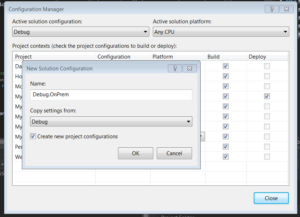

# Two Apps at the same time: Deploy SharePoint Add-In to Cloud AND On-Premise
_Published:_ 13.12.2016 00:00:00

_Categories_: [csharp](/dotnetwork/en/categories#csharp) - [sharepoint-en](/dotnetwork/en/categories#sharepoint-en)

_Tags_: [apps](/dotnetwork/en/tags#apps) - [csom](/dotnetwork/en/tags#csom) - [office365](/dotnetwork/en/tags#office365) - [onpremise](/dotnetwork/en/tags#onpremise) - [provider-hosted-add-in](/dotnetwork/en/tags#provider-hosted-add-in) - [sharepoint-en](/dotnetwork/en/tags#sharepoint-en) - [sharepoint2013](/dotnetwork/en/tags#sharepoint2013) - [sharepoint2016](/dotnetwork/en/tags#sharepoint2016)


What the fuzz is this about?

I am not absolutely sure if I am the first one who did this, but it seems at least noone else wrote it down until now. :) We hat a customer who liked our Office365 Provider-Hosted App "Mydea", but wanted us to install that on his SharePoint 2013 - Installation. In Germany a lot of companies do not trust the cloud. So we had three options:

1. Tell the customer this does not work
2. Copy&paste the whole solution and change it so it works on OnPrem
3. Do something else

The first option - of course - wasn't valid for me. The second would have worked. But I did not want to end up in maintanance hell. Our product is about innovation management. And the most innovative about that is the product itself. We develop agile, adding new features (and sometimes bugs) continuously. We do not want to do that twice.

So I ended up on the third option: Changing my solution so it will run in an Office365 - SharePoint **and** on an On-Premise installation of SharePoint 2013 (or above).

Common sense about that path seems to be: _That does not work_. But it does. It just is a real bumby road to get there. This also means: You should know the basics. You should have created at least one \[bs\_tooltip placement="top" trigger="hover" title="Microsoft renamed 'Apps' to 'Add-Ins' Whenever I write one of those it is just always the same"\]Add-In\[/bs\_tooltip\] for Office365 and one for SharePoint 2013 or above. I will not explain these steps here (which are complicated enough for local installation). I also cannot help you there in the comments or by mail.

There are plenty of documents out there that explain what's needed for this. You should read those, first.

If you find this article useful and earn lots of money because of it: Feel free to buy me a beer :)

### Analyzing the differences: What has to be done?

I started with an Office365-App and added the possibility to run that App under an OnPrem-Installation, too. But you should be able to go the other way with little modifications.

My first step was to create two dummy "Hello World"ish Applications. One for O365 and one for an OnPrem-Installation and look at the source, to "diff" it. These are the conclusions I came around:

At most of us use NuGet-Packages, that was the starting point. There are different Packages: You need the following:

OnPrem: - AppForSharePointWebToolKit

Office 365: - AppForSharePointOnlineWebToolKit - Microsoft.SharePointOnline.CSOM

These Packages result in different DLLs with the Prefix _"Microsoft.SharePoint.Client.\*"_, but different Versions. OnPrem: - Version 15.xxx Office 365: - Version 16.xxx

The Sourcecode of the \*.cs - files created by that NuGet-Packages (\_SharePointContext.cs\_ & \_Tokenhelper.cs\_) are exactly the same. So no need to change anything there.

Finally you usually store your Office365-Apps on Azure, but don't for On-Premise-Installations. This results in different Authentications: OnPrem: - Using Certificates - Using Windows Authentication

Office 365: - Using ClientSecret - Using OAuth Authentication

These Informations are stored inside the _Web.Config_

### Before we start

**Create a new Branch in your repository.** You never know what can go wrong :)

### The Web-Project (MVC most likely)

##### Creating different Build configurations

The main purpose if this action was to have just one CodeBase for both versions. So new features or bugfixes have only to be made once. No extra code, no branch, no nothing.

So I started by creating new Build Configurations. You can create them using "Build - Configuration Manager": [](http://dotnet.work/wp-content/uploads/2016/12/showBuildConfigurations.png)

 

Create two Configurations. One for Debug and one for Release. Make sure to copy the Settings from the existing "Debug"- and "Release"-Configuration [](http://dotnet.work/wp-content/uploads/2016/12/newBuildConfiguration.png)

At this point, only do this for your web project and - if you have - any backend-projects that are used by your webproject. We will add others later on, but this way you have the chance to validate every single step:

[](http://dotnet.work/wp-content/uploads/2016/12/buildConfigurationShow.png)

Now its time to create your config file. Find your web.config, click on it with the right mouse button and select "Add config transform". After that you should have a Config file for each configuration

##### Nuget-References

I used the PnP - Packages to develop our O365-Add-In. If you only use the "base" Packages that come with the Add-In-Solution-Template you might have different packages. Nonetheless you will always have a package _"AppForSharePointOnlineWebToolKit"_.

Package-wise the main difference between the O365/OnPrem - road are the Azure- and OAuth-packages that are only on the 365-PnP. Also the Office365 Libraries use Version 16, While OnPrem use Version 15.

To be able to keep your application updated no matter what configuration you use, create two dummy projects e.g. _dummy365_ & _dummyOnprem_. It does not matter what kind of projects these are. The only purpose of these projects is that there are always the packages for both O365 and OnPrem in the _./packages_ - folder.

Add the O365-pnp-NuGet-packages to your dummy365 and the 2013-pnp-nuget-package to your dummyOnPrem

Now: Before you continue, \*\*make a backup of you .csproj - file. It conains information that will be lost after the next step.

Now add the "other" PnP-Package. If you already have the _SharePointPnPCoreOnline_\-Package installed. now install the _SharePointPnpCore2013_ NuGet-Package (and vice-versa)

##### csProj-Changes

You can now diff your csproj - files before and after. Or simply believe my words: There are now two differences. One of them is the _OfficeDevPnP.Core_ - package. The _HintPath_ from the O365 contains _SharePointPnPCoreOnline_, the _HintPath_ from the 2013-Version contains _SharePointPnpCore2013_. This does not seem to be an issue as both DLLs are identical. Nonetheless we will have a look at it. Just in case.

The more interesting detail is the Reference to _"Microsoft.Online.SharePoint.Client.Tenant"_. The Office365 - Version uses Version 16.x and the OnPrem - Version uses 15.x. This is absolutely something we have to care about.

Luckily, the csProj allows some conditions. So create the following new lines:
```
<ItemGroup Condition="'$(Configuration)'=='Debug.OnPrem' Or '$(Configuration)'=='Release.OnPrem'">
<Reference Include="Microsoft.Online.SharePoint.Client.Tenant, Version=15.0.0.0, Culture=neutral, PublicKeyToken=71e9bce111e9429c, processorArchitecture=MSIL">
<HintPath>..\\packages\\SharePointPnPCore2013.2.9.1611.0\\lib\\net45\\Microsoft.Online.SharePoint.Client.Tenant.dll</HintPath>
<Private>True</Private>
</Reference>
<Reference Include="OfficeDevPnP.Core, Version=2.9.1611.0, Culture=neutral, PublicKeyToken=3751622786b357c2, processorArchitecture=MSIL">
<HintPath>..\\packages\\SharePointPnPCore2013.2.9.1611.0\\lib\\net45\\OfficeDevPnP.Core.dll</HintPath>
<Private>True</Private>
</Reference>
</ItemGroup>

<ItemGroup Condition="'$(Configuration)'=='Debug' Or '$(Configuration)'=='Release'">
<Reference Include="Microsoft.Online.SharePoint.Client.Tenant, Version=16.1.0.0, Culture=neutral, PublicKeyToken=71e9bce111e9429c, processorArchitecture=MSIL">
<HintPath>..\\packages\\Microsoft.SharePointOnline.CSOM.16.1.5813.1200\\lib\\net45\\Microsoft.Online.SharePoint.Client.Tenant.dll</HintPath>
<Private>True</Private>
</Reference>

<Reference Include="OfficeDevPnP.Core, Version=2.9.1611.0, Culture=neutral, PublicKeyToken=3751622786b357c2, processorArchitecture=MSIL">
<HintPath>..\\packages\\SharePointPnPCoreOnline.2.9.1611.0\\lib\\net45\\OfficeDevPnP.Core.dll</HintPath>
<Private>True</Private>
</Reference>
</ItemGroup>
```

**Do not just copy/paste the content from here!** Use the lines from within **your** csProj-File instead! Versions will change over time. And when you read these lines, my version used might already be outdated.

As a last step, remove the original lines from within the main _ItemGroup_ containing these two libraries.

Well done. You should now try to rebuild your solution on all your four Build configurations, where the OnPrem-Configurations should create a _Microsoft.Online.SharePoint.Client.Tenant.dll_ with Version 15 in your bin-directory and the Office365-Version should create a V16-dll. If you encounter a problem try to unload and reload the projects.

Please be advised: I am not sure what happens if you update one of those two Nuget-Packages. You might have to modify your csproj-file again

##### Web.Config

Now its time to modify your Web.Configs.

Add the following lines just before the closing _"</configuration>"_ section into your \*.OnPrem.config - files:
```
<runtime>
<assemblyBinding xmlns="urn:schemas-microsoft-com:asm.v1">
<dependentAssembly xdt:Transform="Replace" xdt:Locator="Condition(./\_defaultNamespace:assemblyIdentity/@name='Microsoft.Online.SharePoint.Client.Tenant')">
<assemblyIdentity name="Microsoft.Online.SharePoint.Client.Tenant" publicKeyToken="71e9bce111e9429c" culture="neutral" />
<bindingRedirect oldVersion="0.0.0.0-15.0.0.0" newVersion="15.0.0.0" />
</dependentAssembly>
</assemblyBinding>
</runtime>
```

As before: If at time of reading, the most current version is not 15.0, but 15.1 or higher replace the version numbers instead.

Now it is time to modify your "normal" Configs for Debug and Release
```
<runtime>
<assemblyBinding xmlns="urn:schemas-microsoft-com:asm.v1">
<dependentAssembly xdt:Transform="Replace" xdt:Locator="Condition(./\_defaultNamespace:assemblyIdentity/@name='Microsoft.Online.SharePoint.Client.Tenant')">
<assemblyIdentity name="Microsoft.Online.SharePoint.Client.Tenant" publicKeyToken="71e9bce111e9429c" culture="neutral" />
<bindingRedirect oldVersion="0.0.0.0-16.1.0.0" newVersion="16.1.0.0" />
</dependentAssembly>
</assemblyBinding>
</runtime>
```

This is not 100% necessary at this time as these values should already be in the main Web.Config, but this makes sure it still works if that changes. Again: Check the version number.

### Authentication

Your O365 - Config Files should still contain something like this:
```
<appSettings>
<add key="ClientValidationEnabled" value="true" />
<add key="UnobtrusiveJavaScriptEnabled" value="true" />
<add key="ClientId" value="aaaaaaaa-beef-face-bbbb-cchcchcchcch" />
<add key="ClientSecret" value="lsdschnabbeldiwuppsfkjashriuae=" />
</appSettings>
```

now your OnPrem-configs looks a little bit different:
```
<appSettings>
<add key="ClientValidationEnabled" value="true" />
<add key="UnobtrusiveJavaScriptEnabled" value="true" />
<add key="ClientId" value="aaaaaaaa-beed-face-bbbb-cchcchcchcch" />
<add key="ClientSigningCertificatePath" value="C:\\Certs\\myCert.pfx" />
<add key="ClientSigningCertificatePassword" value="p@ssw0rd" />
<add key="IssuerId" value="bbbbbbbb-beef-face-bbbb-cchcchcchcch" />
</appSettings>
```

The main difference here is that you don't just use a ClientId/ClientSecret - Combination for an OnPrem-Installation but have to use a Certificate. I will not describe here how to obtain it. It is just the "normal" OnPrem-procedure for provider hosted apps. Also be aware that the IssuerId is **not** the ClientId.

If you need help on this part: There are plenty of documents about this. For example on[MSDN](https://msdn.microsoft.com/en-us/library/office/fp179901.aspx)

### Backend, Webjobs and other projects that talk directly to SharePoint

##### App.Config

If you have any other Projects than the Web Project and the AddIn, you might have to do some extra steps. For example if you use a backend-project, you have to modify that, too. Ignore this chapter if you don't have any additional projects.

But if you have any console application (like Azure WebJobs) you have to modify those configs, too. Sadly. Config-transform does not work out of the box with App.Config - files. But there is a way to change that.

First: Create your Config Files manually. So select Add - New Item and select "_Application Config File_". Name it _App.OnPrem.config_. Now open the csProj-File with Notepad. Look for an _ItemGroup_ containing the App.Config. There already should be an _App.Debug.config_ and _App.Release.config_ with a "_DependentUpon_" - Attribute. Just copy that attribute to your newly created files. So that you end with something like this:

```
<ItemGroup>
<None Include="App.config" />
<None Include="App.Debug.config">
<DependentUpon>App.config</DependentUpon>
</None>
<None Include="App.Debug.OnPrem.config" >
<DependentUpon>App.config</DependentUpon>
</None>
<None Include="App.Release.OnPrem.config" >
<DependentUpon>App.config</DependentUpon>
</None>
<None Include="App.Release.config">
<DependentUpon>App.config</DependentUpon>
</None>
</ItemGroup>
```

After that all your OnPrem-Configs should be displayed as children from App.Config in Visual Studio (2015). Now transform should work. You can check your csproj - File. If there is something like _<UsingTask TaskName="TransformXml" ../>_ in it you are ready to go. If not, you are probably using an older Visual Studio version. I would not advise it, but you can go with it, but have to do some extra steps: [XDT Transforms for older VS Versions](http://harrewijnen.net/app-config-xdt-transforms/)

Now its the same fun again with the config files as before. So add the same stuff into the App.\*.config - files as you have done with the web.configs. In addtion add the transform Property to the configuration tag, so it looks like this: <configuration xmlns:xdt="http://schemas.microsoft.com/XML-Document-Transform">

### Test what you have done until now

Now you should build your Solution for all four configurations. Check if all DLLs where created correctly for the O365 and OnPrem-Configurations. Deploy your application still with the O365 - Settings. Everything should look like before.

### Changes on the Web Project

Now it is time to modify your main SharePoint-Project.

First of all: Add your SharePoint-Project to the build configurations. The good thing is: This time you don't have to care about the configs. There will most likely be an app.config in your SharePoint-project, but you can just ignore it, because there are no real references in this project.

##### SharePoint - URL

The (nearly) final step is to put the right SharePoint-URL to your AddIn-Project depending on your Configuration. The simple way is to just enter the right URL each time you start debugging. The more complex (but better) way is to go the same way as you did with the MVC (Server) part. To do this, enter your Build-Configuration Settings again and set "_Debug.OnPrem_" and "_Release.OnPrem_" for your AddIn-Project.

The URL is stored in the user-settings instead of the project settings. But you can use the same magic to make a conditional path there. Open the file YourApp.csproj.user and add the condition to the "SharePointSiteUrl" - entry:

```
<PropertyGroup>
<SharePointSiteUrl Condition="'$(Configuration)'=='Debug.OnPrem' Or '$(Configuration)'=='Release.OnPrem'">http://myDevMachine:10000/sites/Dev\_Ole/</SharePointSiteUrl>
<SharePointSiteUrl Condition="'$(Configuration)'=='Debug' Or '$(Configuration)'=='Release'">https://my365AppName.sharepoint.com/sites/dev-ole/</SharePointSiteUrl>
</PropertyGroup>
```

IF you want you can also simply delete the user-file and put these values into your main .csproj. Sadly this cannot be loaded "on the fly" by switching your Build configuration . You have to unload and reload your project for this setting to be re-read. This is no issue when deploying your solution using an automated build (like tfs online), but while debugging locally.

##### Target office version & SharePoint-URL

The csproj - file contains an entry called "_TargetOfficeVersion_" which should contain the value "16.1". Just like before we need to modify this using conditional values.

```
<TargetOfficeVersion Condition="'$(Configuration)'=='Debug' Or '$(Configuration)'=='Release'">16.1</TargetOfficeVersion>
<TargetOfficeVersion Condition="'$(Configuration)'=='Debug.OnPrem' Or '$(Configuration)'=='Release.OnPrem'">15.0</TargetOfficeVersion>
```

You can validate this setting while selecting the properties of the project and display the "Sharepoint"-Tab. Under "Target Sharepoint version" it should say "SharePoint 2013" if 15.0 is used or "SharePoint Online" if 16.1 is used.

##### Authentication

Office365 uses OAuth for Authentication. For SharePoint 2013 you have to use Windows Authentication instead. As I wrote before: There are a few documents out there explaining the Certificate-Part. But you also have to tell your project to use Windows Authentication. Again we use the same conditions like before, but this time use it for the IISExpressAuth:

```
<IISExpressWindowsAuthentication Condition="'$(Configuration)'=='Debug.OnPrem' Or '$(Configuration)'=='Release.OnPrem'">enabled</IISExpressWindowsAuthentication>
<IISExpressWindowsAuthentication Condition="'$(Configuration)'=='Debug' Or '$(Configuration)'=='Release'">disabled</IISExpressWindowsAuthentication>
```

##### AppManifest

The Appmanifest does not allow any conditional entries. That's why we have to create a copy of it and do the conditional stuff inside the csproj file. So first create a copy called AppManifest.OnPrem.xmlns

In that file change the "SharePointMinVersion" from _16.0.0.0_ to _15.0.0.0_ in the "_App_"-Section.

Now it is finally time again to modify the csproj - File. You should be used to it by now :)

```
<ItemGroup Condition="'$(Configuration)'=='Debug.OnPrem' Or '$(Configuration)'=='Release.OnPrem'">
<AppManifestFile Include="AppManifest.OnPrem.xml">
<SubType>Designer</SubType>
</AppManifestFile>
</ItemGroup>
<ItemGroup Condition="'$(Configuration)'=='Debug' Or '$(Configuration)'=='Release'">
<AppManifestFile Include="AppManifest.xml">
<SubType>Designer</SubType>
</AppManifestFile>
</ItemGroup>
```
 

## Things to mention on V 15.0 (SharePoint 2013)

While most of the code works on Version 15.0 as well on 16.1, there are some minor differences between these two. The following issues appeared on my project: - FieldUserValue has no Property "Email" - Microsoft.Client.SharePoint.Folder has no "Exists()" Both work on 16.1 but not on 15.0. So you have to write your own code to get around this issue.

### Custom Compiler Symbols

Because of the differences between V16 and V15 you might want to have custom code depending on your configuration. Just like the DEBUG - Symbol you can add your custom Symbol for the OnPrem-Configurations. Just select the properties of each project you need that symbol in, select the Build - tab and into "_Conditional compilation symbol_s" enter "_ONPREM_" (or whatever you like):

[](http://dotnet.work/wp-content/uploads/2016/12/symbol.png)

Afterwards you can use the following code:

```
#if OnPrem
var userMail=GetMailFromUser(fieldUserValue); 
#else 
var userMail=FieldUserValue.Email;
#endif
```

## Final thoughts

You are done now. Just keep in mind: If you use any Azure-connections (e.g. for caching, insights, blob-storage) you will have to handle that, too if you need to get rid of any external connection. The custom Compiler Symbols should help you with that task
