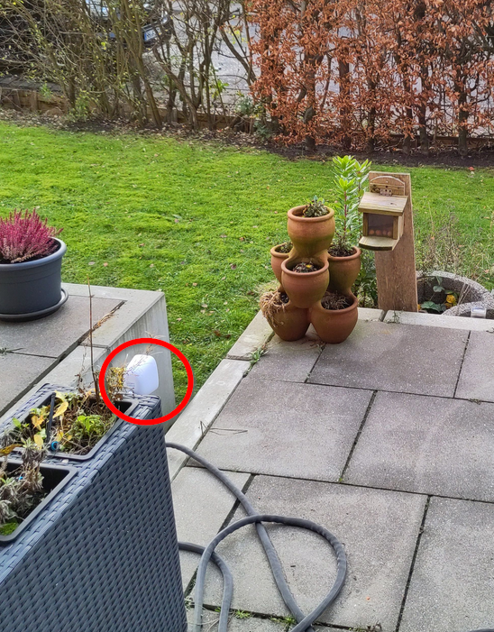
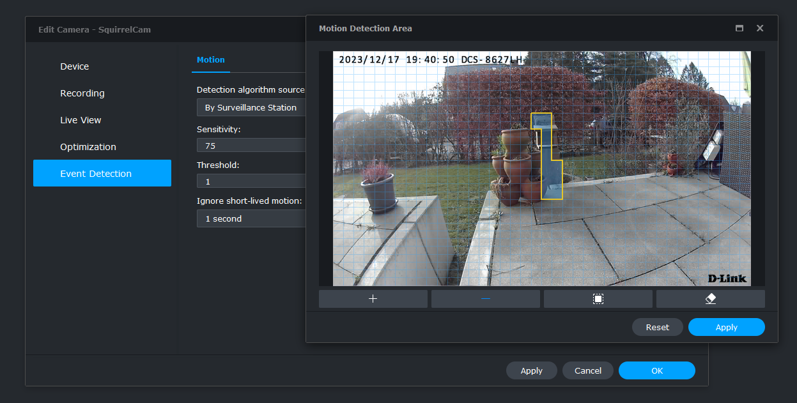
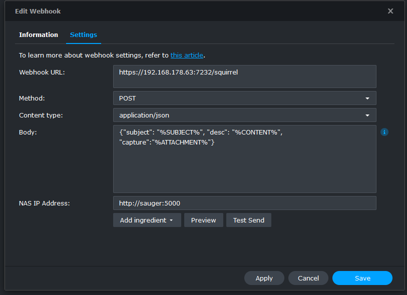
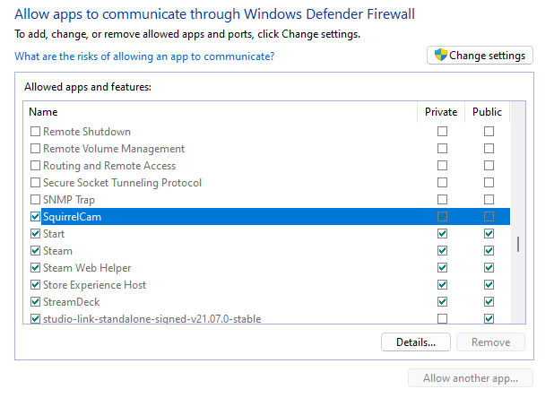
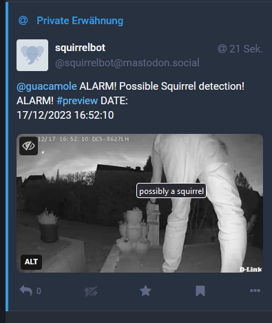

[Disclaimer: This is not meant as a tutorial, more as some chitchat. You can find the source on github nonetheless, but I assume this is a VERY specific use case noone else uses]

Let's start by telling you that this whole project ist utter nonsense. Noone really *needs* this feature. I decided to create this nonetheless.

## The Goal
I own a little feeding box for squirrels of the neighbourhood. And it works as designed: Squirrels get here, steal their food and run away. 

I can see them through my glass door and it just looks amazing, especially in the typical "Hamburger Wetter" (Hamburg weather, means: raining horizontally). Sometimes I take a picture or even a video, but through the door that just does not look very great.

So I decided to add a surveillance cam to the mix, and while I am on it: Automatically publish whenever a squirrel appears

### Hardware
I use a dlink - outdoor webcam with WiFi. Not really worth looking up the model number here, just the cheapest WiFi-Cam I could find which is compatible with Synology Surveillance Station (but nearly all are)

In addition the Synology NAS with installed surveillance station. I own a DS920+, but any should do

### Privacy
I do not want to track any persons. Not me, not others. This is not meant to be surveillance, it is meant to film squirrels. TBH I did not ask the squirrels how they think about privacy and GDPR, but I assume they are fine with it. After all they accepted all Cookies until now, and not only the required ones.

To make sure only squirrels (or other animals) get caught I wanted to do a few conditions: 
* Only track movement directly in front of the feeder. 
  * So I can make sure not Humans or Traffic in the background trigger the motion sensor
* Put the Camera in "Squirrel"-height.
  * So even if someone (me or my guests) manages to trigger the alarm no faces can be seen
* Have a simple to use approval workflow
  * Just in case. If someone ends up lying there drunk I do not want to publish a video of that person anywhere

#### Only Track movement directly in front of the feeder
That is one of the reasons why I use the Surveillance Station of Synology. The Camera itself has movement detection and (according to the documentation) even a fancy AI "this is a person" algortihm. I do not want the last for obvious reasons and especially can not decide which area of the image should be used for detection. In addition this seems to require a cloud feature.
I do not want my camera feed in the cloud from anyone. This should never leave my house without my consent. The surveillance station can select very small pieces of the image to be selected as alert regions. I put it directly in front of the feeder where no background movement can be detected. This way I can also adjust the sensibility of the detection to quite a high value because no noise becaues of branches moving in the wind etc. is to be expected.

#### Put the camera in squirrel-height
That was easy as there are some flowerboxes directly before the feeder where I mounted the cam



#### Have a simple approval workflow
Because I mostly am at Mastodon at time of this writing (these sentences sometimes age very bad. A few months ago that would have been the artist formerly known as Twitter, which itself was just a replacement for Google+ which, well, you know the sad story). Let's just hope that was the last Social Media switch for me.

One of the advantages of Mastodon is that it has a very nice, simple API that allows sending toots, getting Notifications and so on. So my idea for the workflow is to notify me (and only me) that a new movement has been detected. Attach an image of that movement and if I approve this (e.g. by adding a "fav" to that toot) the bot knows that this detection was a valid Squirrel video and posts it. So AI without the "A". (some might argue even without the "I"...)

## Synology
Adding the Webcam is quite simple. It nearly is found automatically in Surveillance station. Finding out how to connect was a bit harder. Username is always "admin" and the required password is a PIN. Printed onto the Power Plug, not the device...
After that the App of the camera does not like the Camera anymore, which is bonus for  me as I do not want images to be uploaded to dlink, anyways.

The detection area can be set in the Camera options.  Fiddling with the thresholds takes a while, especially as I do not have a trained squirrel to assist me on that. I then changed the time plan to always motion detection (so disabling the constant recording) and updated the minimum record time to five minutes. A good comprimise between getting everything and not creating videos that are too big for mastodon/youtube/wherever I wanted to upload this, which I had not decided at this point

Synology has multiple ways to notify about movements: Email, SMS, Push notifications and Webhooks. Obviously the last one was the way to go as it does not spam me in any way and I have to program stuff anyways.

## Writing a Webhook

A webhook is just an HTTP-call essentially. Synology allows POST and PUT in Surveillance Station. So I created a simple Web Api in Visual Studio and was ready to debug the incoming data. 

### Firewalls, Firewalls everywhere!
Synology allows you to send a test-notification which just resulted in an error. WHAT exactly went wrong is nowhere to be seen. Not in surveillance station and not in the logs from the synology. So I had to fly blind at this point.

I knew it worked when using my local machine, either via localhost or the ipadress from my development machine.

So the next step was to connect to my synology via SSH and try to access my API throuh a simple webcall via GET:
`wget https://192.168.178.23:6789/ping`

This simple call already did not work. So must have been a firewall issue. I checked everything in my Synology configuration FOR A VERY LONG TIME and did find nothing. Finally I put my attention to Windows, disabled the Defender Firewall and it went through. Because I do not want to have the firewall open I added an exception through the "allow an app through windows firewall" and finally it did work with the firewall still enabled.


### Receiving data from the webhook

The Webhook arrived as expected, has some informations in it and can even provide an url to a preview image. That image URL is a generated "public" (within my LAN) Address I am able to receive and download:

```csharp
app.MapPost("/squirrel", async context =>
{
    var requestBody = await context.Request.ReadFromJsonAsync<SynologyBody>();
    if (requestBody != null)
    {
        if (!string.IsNullOrWhiteSpace(requestBody.Capture))
        {
            var previewImage = await downloader.DownloadFile(requestBody.Capture);                                    
        }
        else
        {
            Console.WriteLine("received event without image. Will ignore it");
        }
    }
    await context.Response.WriteAsync("event received");
});

public class SynologyBody {
  public string Subject { get; set; } 
  public string Desc { get; set; } 
  public string Capture { get; set; } 
}
```
(Synology does not really care about the response but I found it useful when testing locally through Postman)

At this point I do not have a video yet which is to be expected, as "normal" users would expect to receive the warning *immediately* and not five minutes *after* someone stole their nuts.

### Send private notification to Mastodon
After an event have been received the Image is downloaded and a message is sent to Mastodon using MastoNet:

```csharp
private MastodonClient Login()
{
    return new MastodonClient(_instance, _accessToken);
}

public async Task<Status?> SendPreview(Stream previewFile, DateTime notificationDate)
{
    var client = Login();
    var text = $"{_approver} ALARM! Possible Squirrel detection! ALARM! #preview DATE:\n{notificationDate}\n";
    var media=await client.UploadMedia(previewFile, "squirrel.png", "possibly a squirrel");
    var status=await client.PublishStatus(text, Visibility.Direct, mediaIds: new[] {media.Id }); 
    if (string.IsNullOrWhiteSpace(status.Id))
    {
        Console.WriteLine("Could not send preview");
        return null;
    }
    Console.WriteLine($"Published to Mastodon with id {status.Id}");
    return status;
}
```

This creates the following toot:


### Waiting for approval
This toot has only been sent to me privately (mastodon has no encryption so always keep that in mind about the "privacy" - part). I can then decide that this is a valid Squirrel detection by setting the "fav" star of that toot.

### Keeping the state
To be able to understand which previewtoot belongs to what webhook call I need to store the state. I uses LitDB for this. LiteDB is a **very** simple document database which needs no installation at all. It completely only lives within the NuGet-Package and the data is stored in a Bson-Format (Json, but compressed).
It is a bit like simply serializing my contents and store it into a Json file. Just performing much better.

That is why the complete "database"-class is as simple as this:

```csharp
 public class DataBase
    {
        private const string _databaseName = @"Filename=squirrel.db;connection=shared";

        public T GetContents<T>(string id)
        {
            using var db = new LiteDatabase(_databaseName);
            return db.GetCollection<T>().FindById(new BsonValue(id));
        }

        public void RemoveContents<T>(string id)
        {
            using var db = new LiteDatabase(_databaseName);
            db.GetCollection<T>().Delete(new BsonValue(id));
        }

        public void UpsertContents<T>(T contents)
        {
            using var db = new LiteDatabase(_databaseName);
            db.GetCollection<T>().Upsert(contents);
        }

        public SquirrelData? FindByFilename(string filename)
        {
            using var db = new LiteDatabase(_databaseName);
            return db.GetCollection<SquirrelData>().FindOne(q => q.ExpectedMovieFile == filename);
        }
    }
```
Now the data inside the Database contains the following stuff:
```csharp
public class SquirrelData
    {
        [BsonId]
        public string Id { get; set; }  // First MastodonID
        public string? PublicId { get; set; }

        public DateTime EventReceived { get; set; }
        public DateTime SentForApproval { get; set; }
        public DateTime? SentPublic { get; set; }
        public DateTime? Faved { get; set; }
        public string? ExpectedMovieFile { get; set; }
    }
```
The Id simply is the Id from the message just posted to mastodon. This object mostly contains Mastodon-Information and Information about the WebHook event. 

As mentioned above the WebHook has no information about the Video that is created (or most likely: Is still being created when the WebHook is sent). So we simply have to find it. 
The rules are quite simple: Within the directory with surveillance videos it is simply the newest file we can find.

One problem remains: The preview image was within the WebHook and did not need authentication do be downloaded. The surveillance directory does need authentication. So I created a user for that specific purpouse allowed it to access the folder and needed to do some SMB-Stuff for authentication.

I used the SMBLibrary for that. It isn't as straight forward as navigating through a filesystem, but it does work fine. First I have to connect using my credentials:

```csharp
 public void Connect()
{
    var smbClient = new SMB1Client(); 
    bool isConnected = smbClient.Connect(IPAddress.Parse(_server), SMBTransportType.DirectTCPTransport);
    if (isConnected)
    {
        NTStatus status = smbClient.Login(string.Empty, _username, _password);
        if (status == NTStatus.STATUS_SUCCESS)
        {
            _smbClient=smbClient;
            return;
        }
    }
    throw new Exception("Connecting failed. Check your credentials");
}
```

After successfully connecting I can access the share and search for the most current mp4-file recursively:

```csharp
     
public string FindMostCurrentVideo()
{
    var store = _smbClient.TreeConnect("surveillance", out var status);
    if (status != NTStatus.STATUS_SUCCESS) throw new Exception("Connecting to Share failed");
    var mostCurrentFile=GetMostCurrentFileRec((SMB1FileStore)store, _startPath);
    return Path.Combine(mostCurrentFile.Path, mostCurrentFile.Filename);
}


private MostCurrentFile GetMostCurrentFileRec(SMB1FileStore store, string folder)
{
    folder += "\\";
    var mostCurrentFile = new MostCurrentFile { Created = DateTime.MinValue };

    var status=store.QueryDirectory(out var subdirectoryList, folder, SMBLibrary.SMB1.FindInformationLevel.SMB_FIND_FILE_DIRECTORY_INFO);
    if (status== NTStatus.STATUS_SUCCESS)
    {
        object directoryHandle;
        FileStatus fileStatus;
        status = store.CreateFile(out directoryHandle, out fileStatus, folder, AccessMask.GENERIC_READ, SMBLibrary.FileAttributes.Directory | SMBLibrary.FileAttributes.Normal, ShareAccess.Read | ShareAccess.Write, CreateDisposition.FILE_OPEN, CreateOptions.FILE_DIRECTORY_FILE, null); ;
        if (status == NTStatus.STATUS_SUCCESS)
        {
            List<FindInformation> fileList2;
            status = store.QueryDirectory(out fileList2, folder+ "*", FindInformationLevel.SMB_FIND_FILE_DIRECTORY_INFO);
            var dirInfo = fileList2.Where(q => q.GetType() == typeof(FindFileDirectoryInfo)).Cast<FindFileDirectoryInfo>();
            var subdirectories=dirInfo.Where(q=>q.ExtFileAttributes.HasFlag(ExtendedFileAttributes.Directory));
            var files=dirInfo.Where(q => !q.ExtFileAttributes.HasFlag(ExtendedFileAttributes.Directory));
            // Look for subdirectories and drill down to them:
            foreach (var directory in subdirectories)
            {
                if (directory.FileName.Contains(".")) continue;
                var mostCurrentSubFile = GetMostCurrentFileRec(store, Path.Combine(folder, directory.FileName));
                if (mostCurrentSubFile.Created > mostCurrentFile.Created) mostCurrentFile = mostCurrentSubFile;
            }

            // Look for .mp4 - Files in current directory and check if they are newer than the most current file known:
            foreach (var file in files.Where(q=>q.FileName.EndsWith(".mp4")))
            {
                if (file.CreationTime > mostCurrentFile.Created)
                {
                    mostCurrentFile = new MostCurrentFile
                    {
                        Created = file.CreationTime.Value,
                        Filename = file.FileName,
                        Path = folder
                    };
                }
            }
            status = store.CloseFile(directoryHandle);
        }
    }
    return mostCurrentFile;
}
```
At this point I do not need the filecontents itself, but only the path so I can use it lateron.

After that we have the whole WebHook complete:
* Reveive the Contents (including preview image) from the webhook
* Determine which Video File matches 
* CHeck if we already had this file (if within a video multiple webhooks are fired) and avoid duplicates
* Send a notification to Mastodon
* Store all known information into our database.

So our Webhook from the beginning now looks like this:
```csharp
app.MapPost("/squirrel", async context =>
{
  var received = DateTime.Now;
  Console.WriteLine("Received squirrel Event");
  var requestBody = await context.Request.ReadFromJsonAsync<SynologyBody>();
  if (requestBody != null)
  {
    if (!string.IsNullOrWhiteSpace(requestBody.Capture))
    {
      var previewImage = await downloader.DownloadFile(requestBody.Capture);
      downloader.Connect();
      string videoFilename = downloader.FindMostCurrentVideo() ?? throw new Exception("No Video Found");
      var existingItem = database.FindByFilename(videoFilename);
      if (existingItem != null)
      {
        Console.WriteLine($"'{videoFilename}' already processed with MastodonId {existingItem.Id}");
        await context.Response.WriteAsync("duplicate event");
        return;
      }
      var mastodonStatus = await mastodon.SendPreview(previewImage, received);
      if (mastodonStatus != null)
      {
        database.UpsertContents(new SquirrelData { EventReceived = received, ExpectedMovieFile = videoFilename, Id = mastodonStatus.Id, SentForApproval = mastodonStatus.CreatedAt });
      }
    }
  }
  await context.Response.WriteAsync("event received");
});
```


## Checking for Notifications
As mentioned the "approval workflow" (a big word for this simple mechanism, I know) is to wait for a fav. If the fav is received it means I decided this is a valid Squirrel detection and the video can be published.

Also do not wait longer than 7 days. If I did not approve in that time, it probably is not a good video.

Again using MastoNet I can receive the Notifications for that user:
```csharp
public async Task<List<Notification>> GetFavs()
{
  var favourites= new List<Notification>();
  var client=Login();
  var notifications=await client.GetNotifications();
  foreach (var notification in notifications)
  {
    switch (notification.Type)
    {
      case "mention":
        await client.PublishStatus($"Sorry. I am just a bot and will not respond to this. Ask {_approver} if you want to know anything about what I do", replyStatusId: notification.Id);
        await client.DismissNotification(notification.Id);
        break;
      case "favourite":
        favourites.Add(notification);
        break;
      default:
        Console.WriteLine($"discarding notification of type {notification.Type}");
        await client.DismissNotification(notification.Id);
        break;
    }
  }
  return favourites;
}
```

The nofication.Status.Id now is the id we already stored in the Database and can use to find all known WebHook-Data of that event and send a new Toot. This time just with the Video file instead of the preview image.

#### Why no Mastodon Webhooks?
The Mastodon API also offers Webhooks. So instead of periodially polling for new notifications this could be used to receive the favs. The main reason why I did not use this (apart from the fact that polling is simply fast enough) is the fact that my application is not accessible from the outside. To allow this I would need to make my NAS (where the application is hosted) accessible from the Internet. And I do not want that. I could add Firewall rules to only allow specific ports and so on, but no access is even a bit better than a limited access. Even if noone would get through, just bots *trying* the flood my machine with requests is a headache I do not need.

## Uploading the Video 
After trying to uplaad the Video directly to Mastodon the next problem came up: The file was too big. While it was way inside the limits the upload (to the mastodon.social instance) just responded with an error "something went wrong". I suspect the Library to be the main issue as the Upload is not done async and so a timeout might be the cause. 

That is why I decided to upload the Video to YouTube instead. YouTube provides APIs to do that. The main issue is that this also requires an OAuth authentication. Luckily the documentation for this are quite straight-forward so a simple Test worked fine:
```csharp
public async Task UploadVideo(Stream fileStream)
{
  var youtubeService = new YouTubeService(new BaseClientService.Initializer()
  {
      ApiKey = _apiKey,
      ApplicationName = this.GetType().ToString()
  });
  
  UserCredential credential;
  using (var stream = new FileStream("secrets.json", FileMode.Open, FileAccess.Read))
  {
    credential = await GoogleWebAuthorizationBroker.AuthorizeAsync(GoogleClientSecrets.Load(stream).Secrets,new[] { YouTubeService.Scope.YoutubeUpload },"user",CancellationToken.None);
  }

  youtubeService = new YouTubeService(new BaseClientService.Initializer()
  {
      HttpClientInitializer = credential,
      ApplicationName = Assembly.GetExecutingAssembly().GetName().Name
  });

  var video = new Video();
  video.Snippet = new VideoSnippet();
  video.Snippet.Title = "Squirrel detected";
  video.Snippet.Description = "You should have bought a squirrel";
  video.Snippet.Tags = new string[] { "squirrel" };
  video.Snippet.CategoryId = "22"; 
  video.Status = new VideoStatus
  {
      MadeForKids = false,
      SelfDeclaredMadeForKids = false
  };
  video.Status.PrivacyStatus = "private"; 
  var videosInsertRequest = youtubeService.Videos.Insert(video, "snippet,status", fileStream, "video/*");
  videosInsertRequest.ProgressChanged += videosInsertRequest_ProgressChanged;
  videosInsertRequest.ResponseReceived += videosInsertRequest_ResponseReceived;

  await videosInsertRequest.UploadAsync();
}
private void videosInsertRequest_ResponseReceived(Video obj)
{
  Console.WriteLine($"done");
}

private void videosInsertRequest_ProgressChanged(IUploadProgress obj)
{
  Console.WriteLine($"Bytes: {obj.BytesSent}| Status: {obj.Status}");
}
```
(secrets.json contains a client_id and client_secret for oauth)
While uploading the `ProgressChanged` event gets fired a few times. Obj.Status cycles from Starting, Uploading to Completed. Which is also the Status when `ResponseReceived` is fired.


Because I had to switch to YouTube I also changed the workflow a bit. Now I already upload the video when posting the preview toot as private on YouTube. So I can verify the complete contents before an approval. And YouTube can process the video while it is waiting for approval. At the end I just switch from `private` to `unlisted` if it is approved or delete the Video if no approval has been made for a period of time.


### Another Pitfall
YouTube does **not** allow using service accounts when uploading Videos. This was crucial for my application because this should run on a server. While the code above works I hit a dead end here. So back to Mastodon:

### FfMpeg
To reduce the filesize I went to FFMpeg. I can compress Videos and - if required - even resize them. Because I do not want to call something on the console, I needed a wrapper. I found FfmpegCore which does exactly what I want:
```csharp
public async Task<bool> ResizeVideo(string source, string target)
{
	return await FFMpegArguments
		.FromFileInput(source)
		.OutputToFile(target, true,
		options=>options
			.WithVideoCodec(VideoCodec.LibX265)
			.WithVideoFilters(filter=>filter
			.Scale(videoSize: FFMpegCore.Enums.VideoSize.FullHd)
			)
		.WithFastStart())
		.ProcessAsynchronously();
}
```

This tiny little piece of code takes any videofile, compresses it as h265 (using default quality settings) and resized it to FullHD (1080 height) maintaining the correvt aspect ratio.

That all works fine on my machine, but because I want to host this (like all my bots) on my Synology-NAS I had to dockerize the contents.  I was in luck this time, but this also turned out to be quite easy:

```
RUN apt-get -y update && apt-get -y upgrade && apt-get install -y --no-install-recommends ffmpeg
```

A single Line in the DockerFile and everything was working smoothly

### Fixing the Api
The reduced Filesize did not solve the problem that Mastodon did not want to upload my file. So I digged a bit deeper into the Mastodon API. The media upload used by MastoNet seemed to marked as depricated (v1) exactly for the reason why I did not work in my project: It was meant for small preview images, not for Video files.

A V2-Version (is available)[https://docs.joinmastodon.org/methods/media/#v2] but not implemented by MastoNet. So I forked the packages from Github and added a V2-Version:

```csharp
public async Task<Attachment> UploadMediaAsync(MediaDefinition media, string? description = null,
AttachmentFocusData? focus = null)
{
	media.ParamName = "file";
	var list = new List<MediaDefinition>() { media };
	var data = new Dictionary<string, string>();
	if (description != null)
	{
		data.Add("description", description);
	}

	if (focus != null)
	{
		data.Add("focus", $"{focus.X},{focus.Y}");
	}

	return await this.Post<Attachment>("/api/v2/media", data, list);
}
```
This was confusingly easy as I simpy just replaced "v1" by "v2". Still it worked. Problem was: The next step, usually taking the returned Id and add this to a toot failed, because Mastodon was not finished, yet. I could simply have waited a long enough time, but decided to add a poll to receive status updates. Every Media of a known I can be requested. There is no statusflag about it processing but some properties give a hint:
First there is the `previewUrl` this is filled at the very start after uploading. Tbe `Url`-Property, however *isn't*. This will always be Null until everything is processed. So just requesting the Media every 10 seconds until the Url is filled did the trick;

```csharp
public async Task<Attachment> WaitUntilMediaIsUploaded(Attachment attachment, int waitSeconds = 10, int maxWaitSeconds = 300)
{
	int totalTimeWasted = 0;
	while (attachment.Id != null && attachment.Url == null && attachment.PreviewUrl != null && totalTimeWasted < maxWaitSeconds)
	{
		Thread.Sleep(waitSeconds * 1000);
		totalTimeWasted += waitSeconds;
		attachment = await GetMedia(attachment.Id);
	}
	return attachment;
}

public async Task<Attachment> GetMedia(string mediaId)
{
	var attachment = await this.Get<Attachment>("/api/v1/media/" + mediaId);
	var prev = attachment.PreviewUrl;
	var url = attachment.Url;
	return attachment;
}
```

# Finally


So that was the last Pitfall. Now everything works:

1. If a motion is detected my WebHook gets called
2. The Webhook posts a previewimage as a direct toot (only be seen by me) to Mastodon including a Preview Image
3. If "fav" the toot when this is a valid Squirrel detection
4. The Bot checks for new Favs and finds mine
5. The according Video is found in the LiteDB
5. The Video gets downloaded via SMB-Stuff
6. The Video gets Resized by FfMpeg
7. The resized video gets uploaded to Mastodon
8. A public toot containing the video is created

(Using standard Mastodon-Features, all toots will get deleted after two weeks reducing the space required)


## But WHY?

I am **very** aware that this was mostly a waste of time. A lot of time for a simple "Lets show when there is a squirrel". Simone Gierts once did a great TED - Talk (Why you should make useless things)[https://www.youtube.com/watch?v=c0bsKc4tiuY]. While she talks about robots, by fun thing to do was alway coding. No matter how useless the results are.
So: Yes. I totally agree with her. Creating stupid things just because it is fun, with noone asking why this takes so long and even be able to quit if something becomes boring is a nice diversion to the normal coding reality I have for paying the rent.

I hope you also had some fun reading this; I had writing it :)

