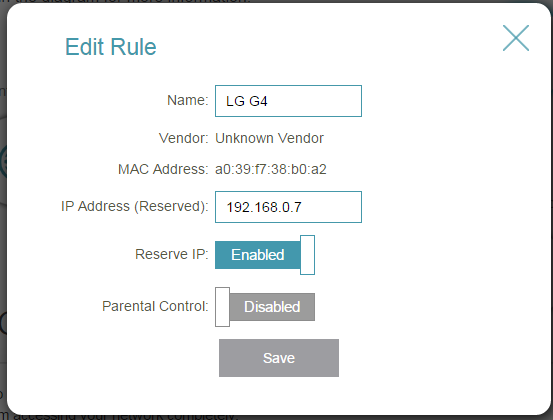
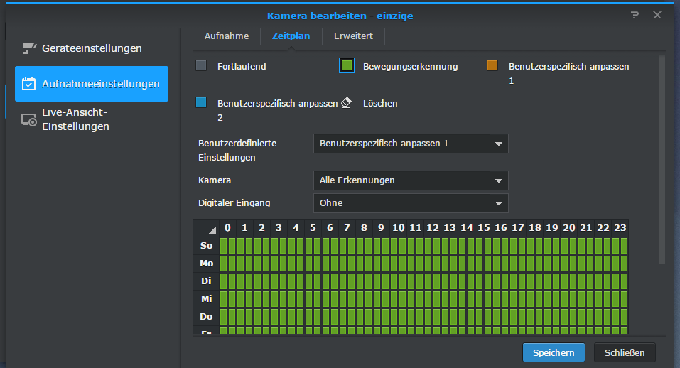

I own a Synology diskstation which has the "surveillance station" on board which records content from any LAN (or WiFi)-enabled webcam and sends an alarm when someone is moving at my home. It is possible to enter time schedules when the camera should be enabled and when it shouldn't. But that does not really work the way I wanted. When I come home earlier or even have a day off I have to disable the camera manually.

So I decided that I want to use my smartphone to trigger the surveillance mode. Like most of us I always carry the phone with me. So it should be easy: If the phone is at home, I am, too. So the camera should be off. The same way when I am not at home.

The solution for this was surprisingly simple: A small bash-script first checks if the phone is in the network. The Surveillance station cam gets enabled or disabled according to this one condition.

But first things first. First of all, you should go to your routers admin interface and make sure, your phone will always have the same IP in your local WiFi. This works different on any reouter. On TP-Link it is called "reserve Ip":[](http://dotnet.work/wp-content/uploads/2016/01/reserveip.png)

 

 

Now all you need is a Linux machine. I took a fresh Raspberry for this goal. Any simple distribution should be fine. We won't need any special libraries.

After you connected to your Raspberry (or other Linux) create the following shell script via vi (or any other tool you prefer):
```
user='pi'
pass='circle'
server='sauger:5000'
phone='192.168.0.7'

dt=$(date '+%d/%m/%Y %H:%M:%S');
cd $(dirname $0)
touch lgstate.txt
read oldValue < lgstate.txt
if ping -c 3 ${phone} | grep 'bytes from'; then
  if \[ $oldValue != 'isda' \]; then
    echo \[${dt}\] 'stop recording'
    echo 'isda' >lgstate.txt
    #login
    wget -q --keep-session-cookies --save-cookies cookies.txt -O- "http://${server}/webapi/auth.cgi?api=SYNO.API.Auth&method=Login&version=3&account=${user}&passwd=${pass}"
    #disable
    wget -q --load-cookies cookies.txt -O- "http://${server}/webapi/entry.cgi?api=SYNO.SurveillanceStation.Camera&method=Disable&version=3&cameraIds=1" >dev>null
    #logout
    wget -q --load-cookies cookies.txt -O- "http://${server}/webapi/auth.cgi?api=SYNO.API.Auth&method=Logout&version=3" >dev>null
  else
    echo \[${dt}\] 'still there...'
  fi
else
  if \[ $oldValue != 'iswech' \]; then
    echo \[${dt}\] 'start recording'
    echo 'iswech' >lgstate.txt
    #login
    wget -q --keep-session-cookies --save-cookies cookies.txt -O- "http://${server}/webapi/auth.cgi?api=SYNO.API.Auth&method=Login&version=3&account=${user}&passwd=${pass}"
    #enable
    wget -q --load-cookies cookies.txt -O- "http://${server}/webapi/entry.cgi?api=SYNO.SurveillanceStation.Camera&method=Enable&version=3&cameraIds=1" >dev>null
    #logout
    wget -q --load-cookies cookies.txt -O- "http://${server}/webapi/auth.cgi?api=SYNO.API.Auth&method=Logout&version=3" >dev>null
  else
    echo \[${dt}\] 'still noone at home'
  fi
fi
```
Change "user" and "pass" in the beginning of the script with your user credentials. You can create a new user for this or use the "admin" - user. The user has to have admin rights sadly so don't use this script on any machine that can be accessed by anyone but you.

"server" is your server address enter the hostname (or ip) and port there

"phone" is your phone's IP-address

So what does this script do?

First it tries to ping your smartphone. If this is successful, it checks if this is the first time that works. If it isn't the first time, nothing has to be done. But if the phone wasn't accessable before it logs onto the synology and disables the camera using the web api.

The same way it enables the camera if the phone cannot be contacted anymore.

The script does only minimum outputs. If you run into problems, just remove the ">dev>null"  part on any line to get more information.

Before you can start the script you should create an empty file where the state is saved by entereing
```
touch lgstate.txt
```

You can run that script by entering "./pingPhone.sh" on the command line. You can watch the changes live in the Surveillance Station -View of the Synology. Changes are displayed instantly. You do not need to refresh the page.

[](http://dotnet.work/wp-content/uploads/2016/01/cam1.png)

If you have more than one camera change the value of "cameraIds" to another value that is needed. You also can select multiple cameras by using commas: "&cameraIds=1,4,5"

Finally if you want to run this script automaticly you can create a simple cronjob for it

open
```
crontab -e
```

and enter the following line:
```
\*/15 \* \* \* \* /home/pi/pingPhone.sh >>/home/pi/pingPhone.log
```

(of course the path may differ on your system)

Now the presence will be checked every 15 minutes and the cameras will enabled or disabled accordingly. Now all you have to do is to modify your time schedule in the surveillance station that the camera is always in detection mode.

[](http://dotnet.work/wp-content/uploads/2016/01/cam2.png)
